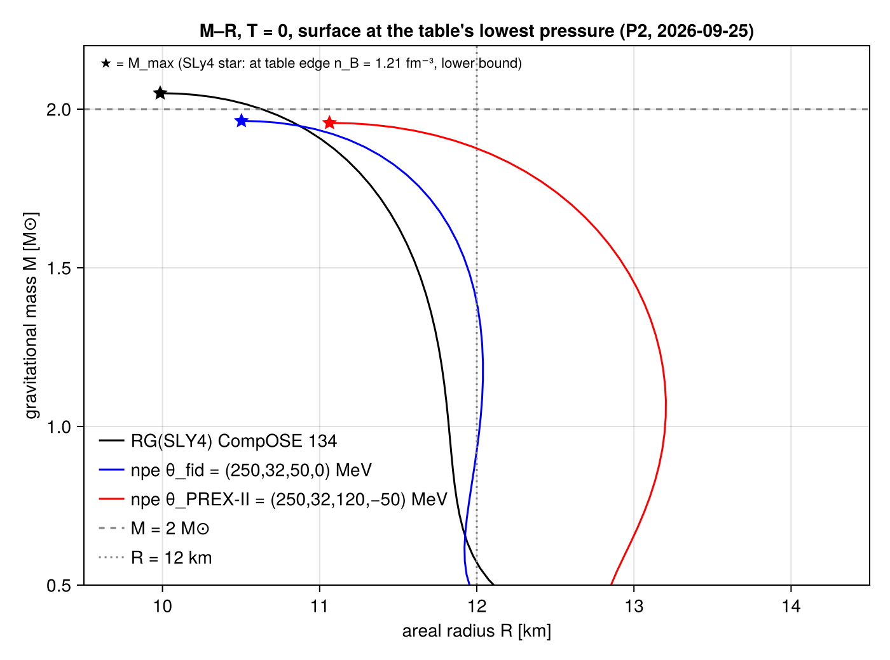

## F1. Background stars

<figure><figcaption><b>F1.</b> Mass–radius curves at T = 0 for SLy4 (CompOSE RG(SLY4) cold table, black) and the two nucleonic models of arXiv:2603.26886: fiducial ($L = 50$, $K_{\rm sym} = 0$ MeV, blue) and PREX-II-like ($L = 120$, $K_{\rm sym} = -50$ MeV, red). Stars mark the maximum mass. Dashed: $2\,M_\odot$; dotted: 12 km. The surface is at each table's lowest pressure.</figcaption></figure>

- Checks passed: the $\Gamma = 2$ polytrope of Font et al. ($M = 1.4002\,M_\odot$, $R = 14.154$ km); the static Love number $k_2$ of Pitre & Poisson to $10^{-6}$; SLy4 $M_{\max} = 2.050\,M_\odot$ and $R_{1.4} = 11.69$ km; the fiducial compactness $C_{1.4} = 0.172$.
- The nucleonic models reach only $M_{\max} \approx 1.96\,M_\odot$, about 4% below the paper's figures. The cause is not yet known.
- Tabulated stars have no atmosphere below the table's lowest pressure, so $R$ and $k_2$ move by $10^{-3}$–$10^{-2}$ with the surface cut-off. $\Lambda = 2k_2/(3C^5)$ does not move ($10^{-8}$). We report cut-off-independent quantities.

| EOS | $M/M_\odot$ | $R$ [km] | $C$ | $k_2$ | $\Lambda$ |
|---|---|---|---|---|---|
| SLy4 | 1.6 | 11.53 | 0.205 | 0.0645 | 119 |
| SLy4 | 1.8 | 11.25 | 0.236 | 0.0469 | 42.5 |
| SLy4 | 2.0 | 10.63 | 0.278 | 0.0272 | 11.0 |
| fiducial | 1.6 | 11.86 | 0.199 | 0.0670 | 142 |
| fiducial | 1.8 | 11.54 | 0.230 | 0.0485 | 49.8 |
| PREX-II | 1.6 | 12.80 | 0.185 | 0.0728 | 226 |
| PREX-II | 1.8 | 12.32 | 0.216 | 0.0521 | 74.3 |
