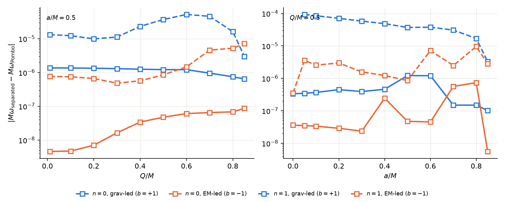
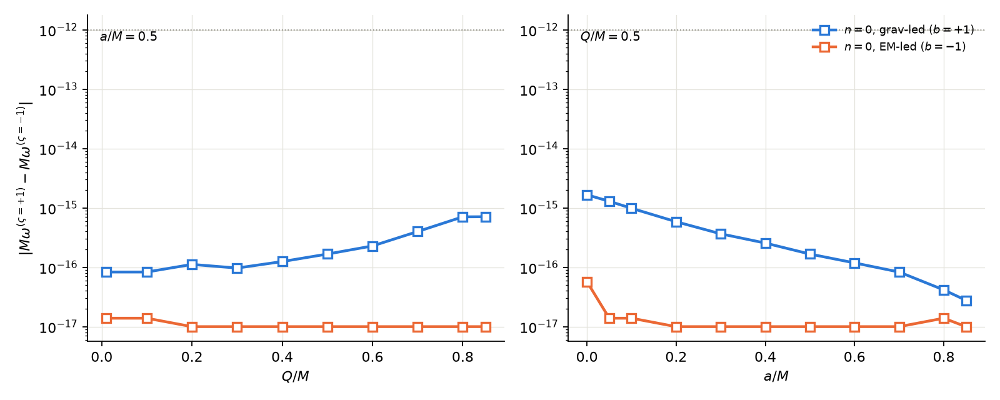
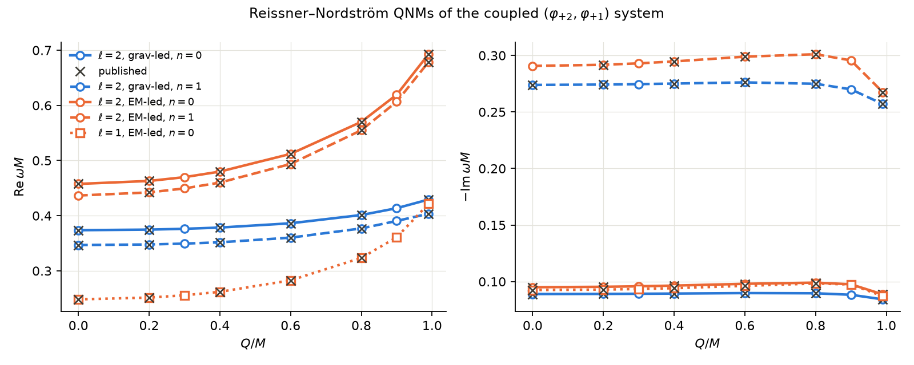
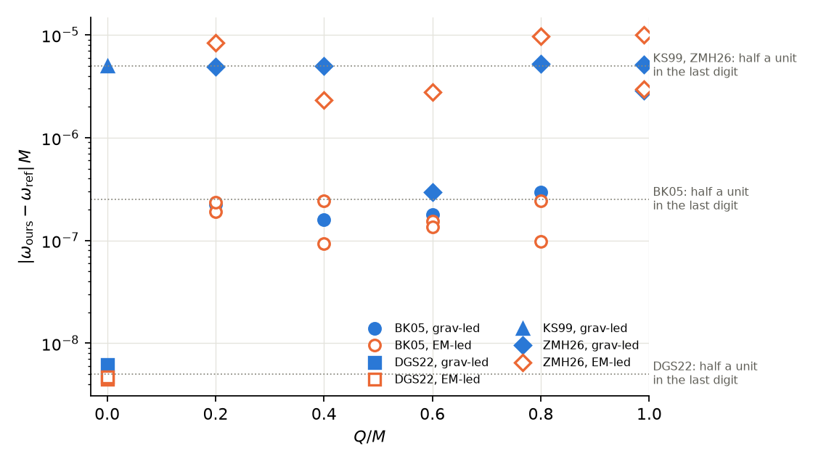

### F2 — Do the separated Kerr–Newman equations give the same QNMs as the coupled equations? (unverified)

<figure><figcaption>Our separated-equation KN frequencies against independent coupled-system data: the differences are the accuracy of that data.</figcaption></figure>

We reproduce Destounis, Cardoso and Hintz (arXiv:2610.07142) with our own solver of Hintz's separated angular and radial equations: a joint Newton solve for $(\omega,\lambda)$ in 40-digit arithmetic.

The figure (our version of their Fig. 1) shows $\lvert M\omega_{\rm separated}-M\omega_{\rm Pombo}\rvert$ on a log scale. Left: against $Q/M$ at $a/M=0.5$. Right: against $a/M$ at $Q/M=0.5$. Modes $\ell=m=2$; blue gravitational-led, orange electromagnetic-led; solid $n=0$, dashed $n=1$; 85 points on the paper's grid. Pombo's data (Zenodo 10.5281/zenodo.21359120) come from a double-precision solver of the coupled equations. The differences are $10^{-9}$–$10^{-6}$ for $n=0$ and $10^{-6}$–$10^{-4}$ for $n=1$, as in the paper. Our values are converged to $\le10^{-13}$, so these differences measure the accuracy of Pombo's data.

<figure><figcaption>The two spin labels $\varsigma=\pm1$ give the same frequencies to $2\times10^{-15}$.</figcaption></figure>

The separated equations exist in two versions, built from $(\Psi_0,\Psi_1)$ ($\varsigma=+1$) and from $(\Psi_4,\Psi_3)$ ($\varsigma=-1$). Solved independently, they agree to $\le2\times10^{-15}$ at every point ($\ell=m=2$, $n=0$), three to five orders below the paper's $10^{-12}$–$10^{-10}$. Their residual differences are numerical.

- Tables I, III and V of the paper are reproduced to $\le4\times10^{-10}$; Tables II and IV ($Q\to0$) to their reference columns. Three of the paper's own $Q\to0$ entries are off by $\sim2\times10^{-6}$.
- At $a=0$ the separated equations give our coupled Reissner–Nordström QNMs ([F1](#results)) to $10^{-11}$: an independent check of F1.
- A data issue: the `KN_a=0.00` files of Pombo's release are not $a=0$ data; we use the `RN_*` files there.
- Not done: the map between the paper's variables and our pair $(\varphi_{+2},\varphi_{+1})$.

**Takeaway.** Hintz's separation is a practical way to compute KN QNMs at high precision, and it agrees with the coupled equations. It will be our reference for the KN code (t10).

**Reproduce.** `tasks/t06-rn-spectral/S3b/`: `reproduce.py` (tables, 18 min), `figs.py` (figure data, 75 min), `plot_figs.py 2026-10-07`.

### F1 — Does our coupled system give the known Reissner–Nordström QNMs? (unverified)

<figure><figcaption>Every published coupled RN QNM lies on the curves from our system.</figcaption></figure>

The coupled linear system for $(\varphi_{+2},\varphi_{+1})$ ([§3, §5](#derivations)), reduced to RN and solved on hyperboloidal slices by Chebyshev collocation in $\sigma\in[0,1]$ (scri to horizon). Time dependence $e^{-i\omega\tau}$, $M=1$.

Left: $\mathrm{Re}\,\omega M$; right: $-\mathrm{Im}\,\omega M$; both against $Q/M\in\{0,0.2,0.3,0.4,0.6,0.8,0.9,0.99\}$. Blue gravitational-led, orange electromagnetic-led; solid $\ell=2$, $n=0$; dashed $\ell=2$, $n=1$; dotted with squares $\ell=1$, $n=0$ (electromagnetic only). Grey crosses: published values (Berti & Kokkotas 2005; Dias, Godazgar & Santos 2022; Kokkotas & Schmidt 1999; Zhou, Ma & Huang 2026). The electromagnetic-led frequencies rise faster with $Q$, and all damping rates drop near extremality.

<figure><figcaption>25 of 28 published values agree with ours in every printed digit.</figcaption></figure>

$\lvert\omega_{\rm ours}-\omega_{\rm ref}\rvert M$ for every published row; dotted lines mark half a unit in each source's last digit. The three exceptions are electromagnetic-led $\ell=2$, $n=1$ values of Zhou, Ma & Huang at $Q=0.2,0.8,0.99$, off by one unit in the 5th decimal. The separated solver of [F2](#results) agrees with ours there to $10^{-11}$, so the error is in that table.

- Our values are converged to $\le10^{-10}$ ($N=84$ against $N=100$); grav-led $n=1$ at $Q\ge0.9$ needs $N=140$–$160$.
- Control: switching off the coupling at $Q=0.6$ moves the frequencies by $4\times10^{-3}$ (grav) and $5\times10^{-3}$ (EM), far above the agreement. No modes outside the two families appear.
- A method finding: in double precision the grav-led eigenvalue is ill-conditioned and stalls at $\sim10^{-7}$. A Newton refinement in 40-digit arithmetic (python-flint) restores geometric convergence.

**Takeaway.** The linear system we derived is the right one, numerically as well as symbolically. The spectral code is ready for the reconstruction (t06 S4) and the second-order sources.

**Reproduce.** `tasks/t06-rn-spectral/S3/`: `qnms.py 84 60` (400 s), then `plot_qnms.py`.
