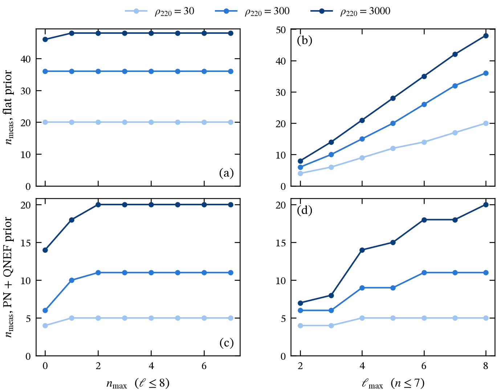
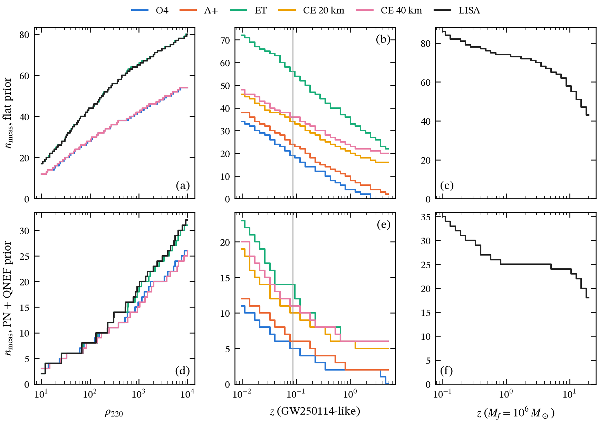

Findings under the v2 model (complex strain, tied mirror modes, detector noise, NR-calibrated priors), newest first. Every analysis starts at $t_0 = 10\,M_f$ after the peak of $|h_{22}|$ unless stated. The v1 plots and the earlier F1 (the calibration scatter) are retired; their numbers remain in the [log](#log).

### F4 — Does the number of channels saturate as modes are added?

<figure>

<figcaption>$n_{\rm meas}$ (real channels) for nested mode sets: left, overtones $n \le n_{\max}$ with all $\ell \le 8$; right, harmonics $\ell \le \ell_{\max}$ with all $n \le 7$. GW250114-like source (equal mass, $\chi_f = 0.686$, $\iota = 0.78$), CE 40 km, from $t_0 = 10\,M_f$. Shades: $\rho_{220} = 30, 300, 3000$. Top: flat prior, with its scale fixed so that the full model has the same expected total SNR as the PN + QNEF prior. Bottom: PN + QNEF prior.</figcaption>
</figure>

**Takeaway.**

- **Overtones saturate at $n_{\max} = 2$** for every SNR shown, under both priors. From $10\,M$ the higher overtones have decayed below reach.
- **Harmonics saturate with the PN + QNEF prior** by $\ell_{\max} = 4$ at $\rho_{220} = 30$ and by 6 at 300. At 3000 the count still gains from $\ell = 8$; that gain is optimistic, because PN overpredicts the weak high-$\ell$ amplitudes (F1).
- **With a flat prior the count grows linearly in $\ell_{\max}$ and never saturates.** Saturation comes from the physical amplitude hierarchy, not from the noise.

**Reproduce.** `python -m mqnm.experiments.saturation`.

### F3 — How many channels can be measured? Per detector, vs SNR and redshift

<figure>

<figcaption>$n_{\rm meas}$ (real channels; each complex mode amplitude has two, so the 220 alone counts as 2) from $t_0 = 10\,M_f$, every mode $\ell \le 8$, $n \le 7$. (a, d) Against the 220's expected optimal SNR $\rho_{220}$, for the GW250114-like source (LISA: $10^6\,M_\odot$ at $z = 1$). (b, e) The GW250114-like source moved in redshift; the grey line is GW250114 ($z = 0.086$). (c, f) A $10^6\,M_\odot$ remnant in LISA. Top: flat prior with the same expected total SNR as the PN + QNEF prior. Bottom: PN + QNEF prior. Networks: O4 and A+ as two co-aligned LIGO detectors (one polarization); ET as a triangle of three 60° interferometers; CE as a single L; LISA as the A and E channels. The source is overhead, $\psi = 0$.</figcaption>
</figure>

**Takeaway.**

- **GW250114 at its distance, PN + QNEF prior:** O4 5, A+ 6, CE 20 km 10, CE 40 km 11, ET 14. That is, the 220 plus about 3 (O4) to 12 (ET) further real channels.
- **Growth with SNR is roughly logarithmic:** about 3 channels at $\rho_{220} = 10$ and 25–32 at $10^4$. Above $\rho_{220} \approx 500$, networks that see both polarizations (ET, LISA) pull ahead.
- **Third-generation detectors keep 5–6 channels out to $z \sim 1$–5**, because the redshifted mass moves the ringdown into their low-frequency band. O4 and A+ drop to the 220 alone.
- **LISA ($10^6\,M_\odot$) keeps about 25 channels from $z \approx 1$ to 5.**
- **At equal total SNR, the flat prior gives 3–4× more channels.** The PN + QNEF structure concentrates the signal into a few correlated directions, so the measurability count depends strongly on what we know about the amplitudes.

**Caveats.** An overhead source with co-located detectors is an idealisation. The PN + QNEF prior is optimistic for the weak high-$\ell$ modes (F1). The count is of *channels* (combinations of amplitudes), not of named modes.

**Reproduce.** `python -m mqnm.experiments.measurability`.

### F2 — A GW250114-like ringdown against the detector sensitivities

<figure>

<figcaption>$2\sqrt f\,|\tilde h_+(f)|$ against $\sqrt{f S_n(f)}$ (Moore, Cole &amp; Berry convention), from $t_0 = 10\,M_f$. Black: the SXS:BBH:0180 strain (equal mass, non-spinning, $\chi_f = 0.686$; all harmonics $\ell \le 8$, $m \ne 0$; $\iota = 0.78$). Grey: 40 draws of every mode ($\ell \le 8$, $n \le 7$) from the QNEF prior conditioned on the fitted 220. (a) GW250114 scaling: $M_f^{\rm det} = 68.1\,M_\odot$, $D_L = 405$ Mpc. (b) $M_f = 10^6\,M_\odot$ at $z = 1$. $h_+$ for $F_+ = 1$; ET and LISA (60° interferometers) at their best orientation. ρ is the optimal single-detector SNR of the NR strain.</figcaption>
</figure>

**Takeaway.**

- The prior draws bracket the real strain.
- Optimal SNRs from $10\,M$: O4 22, A+ 41, ET 187, CE 20 km 223, CE 40 km 326; LISA about 2800 per channel.
- From the peak, O4 gets 35, in line with LVK's network value of about 40 post-merger.

**Caveats.** $\varphi = 0$; $\iota$ is the folded value; $m = 0$ harmonics are left out; $D_L$ comes from $z = M_f^{\rm det}/M_f - 1$.

**Reproduce.** `python -m mqnm.experiments.sensitivity_overlay`.

### F1 — Do the calibrated priors cover NR?

<figure>

<figcaption>(a, b) For each SXS run, both priors are conditioned on that run's own 220 and predict $C_j/C_{220}$ at the merger. Violins pool the predictions and grey dots are NR (jaxqualin). The numbers give the fraction of runs inside their own central 68% (1σ) interval (blue: QNEF, orange: flat); a calibrated prior gives about 68%. (c, d) NR strain for SXS:BBH:0180 and SXS:BBH:1437 from $10\,M_f$ against 5–95% bands from draws of every mode ($\ell \le 8$, $n \le 7$). Green: $|h_{22}|$; yellow: rms of all other $m > 0$ harmonics.</figcaption>
</figure>

**Takeaway.**

- **Per mode, 1σ coverage (target 68%):** 330 92%, 331 76%, 210 61%, 211 62%, but the **221 only 26%**. NR's 221 sits consistently at about 0.8× the QNEF prediction with little scatter, and the rms error ($f = 0.22$) reaches that bias only at its 1σ edge. The 320, 440, 550 and 660 are at 0–37%: PN overpredicts them, which is the optimistic direction for weak modes. The flat prior is at 0–51%.
- **Total strain, coverage across 30 SXS runs:**

| window after the peak | $h_{22}$ | other harmonics | prior / NR for $\lvert h_{22}\rvert$ |
|---|---|---|---|
| 5–10 M | 61% | 2% | 1.78 |
| 10–15 M | 83% | 33% | 1.06 |
| 15–20 M | 95% | 59% | 0.98 |
| 20–25 M | 72% | 68% | 0.97 |

- **This sets the default start at 10 M.** Earlier, the prior predicts too much strain, mostly because jaxqualin amplitudes are extracted where stable (10–15 M) and quoted back at the peak. Improving on this is an open item in the [plan](#plan).

**Reproduce.** `python -m mqnm.experiments.prior_vs_nr`.
