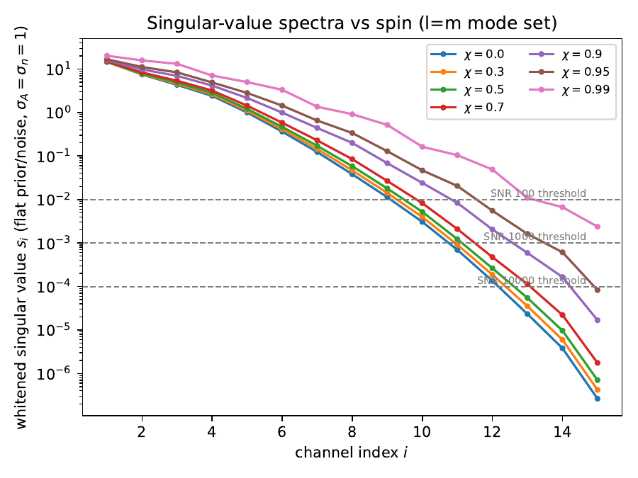
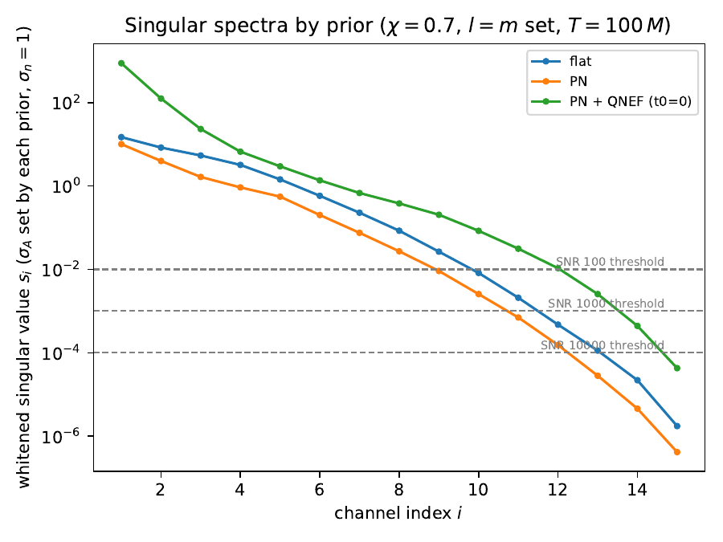
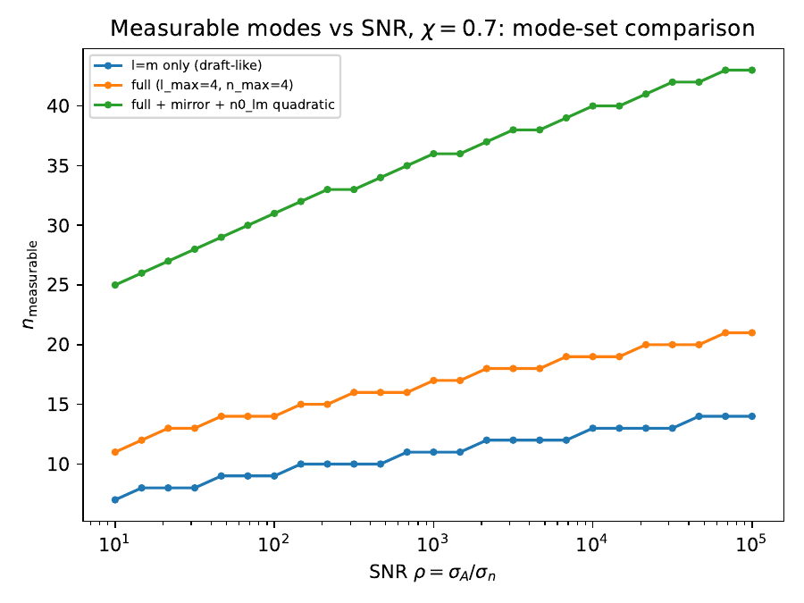
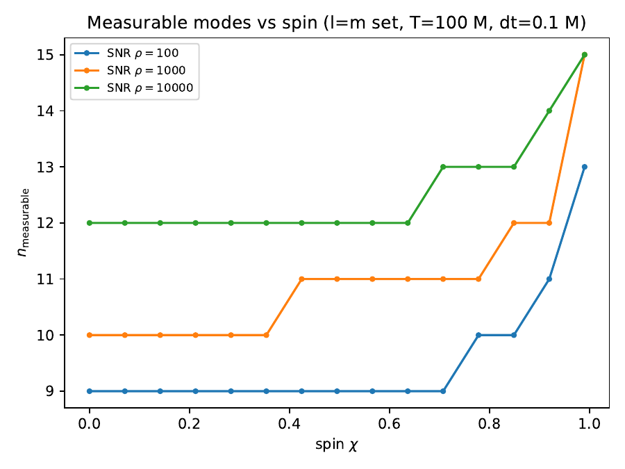
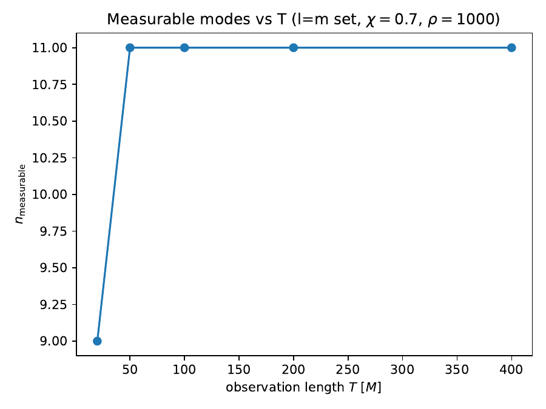
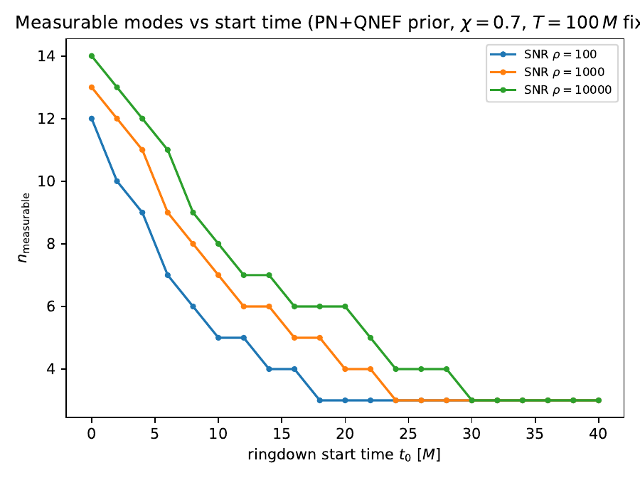
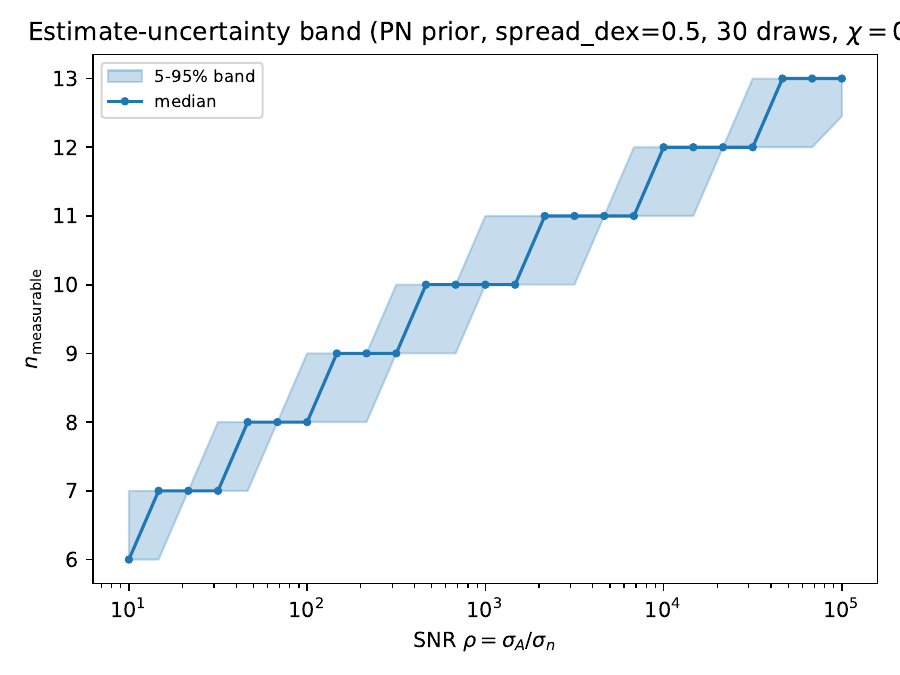
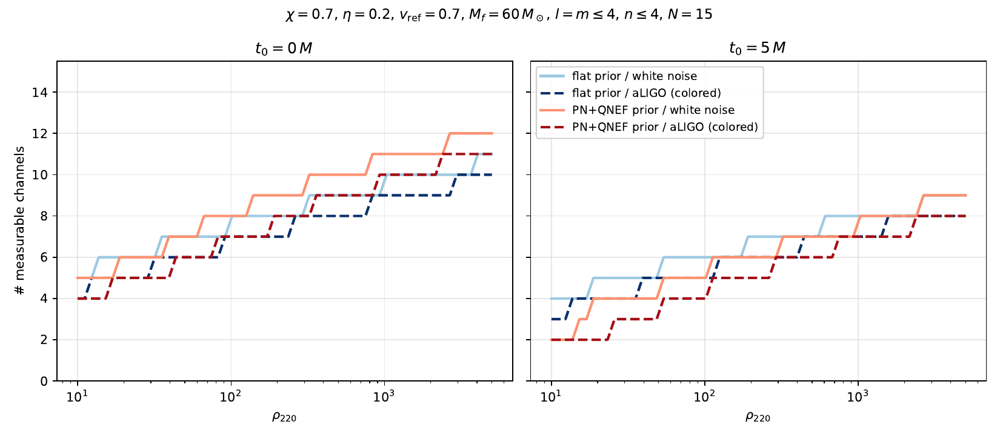

## Singular spectra

<figure>

<figcaption>Whitened singular values $s_i$ of the $\ell = m$ set ($\ell \le 4$, $n \le 4$, 15 modes) for several spins. White noise and a flat prior, $\sigma_A = \sigma_n = 1$, so $s_i = \sigma_i(Z)$. Dashed lines are the $1/\rho$ cuts: at SNR $\rho$, a channel is measurable if it lies above its line. <em>Script:</em> <code>mqnm/experiments/singular_spectra.py</code>.</figcaption>
</figure>

The spectra fall off roughly geometrically, about half a decade per index at $\chi = 0.7$. That is why $n_{\rm meas}$ grows like $\log\rho$. Higher spin flattens the tail, strongly above $\chi \approx 0.9$.

<figure>

<figcaption>The same spectrum at $\chi = 0.7$ under three priors, each setting its own $\sigma_A$ ($\sigma_n = 1$). PN + QNEF is evaluated at $t_0 = 0$. <em>Script:</em> <code>mqnm/experiments/prior_comparison.py</code>.</figcaption>
</figure>

The QNEF overtone growth lifts the top of the spectrum by about two decades and gives roughly two extra channels at fixed $\rho$. PN alone moves the spectrum down relative to flat, because the subdominant multipoles are suppressed.

## Measurable channels vs SNR, spin, duration

<figure>

<figcaption>$n_{\rm meas}$ against $\rho = \sigma_A/\sigma_n$ at $\chi = 0.7$, for three mode sets: $\ell = m$ only; full $\ell \le 4$, $n \le 4$; and full + mirror + quadratic (all pairs of $n = 0$, $\ell = m$ fundamentals). White noise, flat prior. <em>Script:</em> <code>measurable_sweeps.py</code>.</figcaption>
</figure>

<figure>

<figcaption>$n_{\rm meas}$ against spin for the $\ell = m$ set, $T = 100\,M$, $\Delta t = 0.1\,M$, at three SNRs.</figcaption>
</figure>

<figure>

<figcaption>$n_{\rm meas}$ against segment length $T$ ($\chi = 0.7$, $\rho = 10^3$). It saturates by $T = 50\,M$, because the ringdown is gone by then.</figcaption>
</figure>

## Start time and prior uncertainty

<figure>

<figcaption>$n_{\rm meas}$ against analysis start time $t_0$ with the PN + QNEF prior ($\chi = 0.7$, $T = 100\,M$ fixed). Overtone amplitudes are carried to $t_0$ with $e^{\mathrm{Im}\,\omega_n (t_0 - t_{\rm ref})}$. See <a href="#derivations">derivations</a>.</figcaption>
</figure>

<figure>

<figcaption>The error bar on the headline number. Each mode's PN scale gets an independent log-normal factor (0.5 dex, 30 draws). The plot shows the median $n_{\rm meas}$ and the 5–95% band against $\rho$ ($\chi = 0.7$).</figcaption>
</figure>

## Detectability with coloured noise

<figure>

<figcaption>$n_{\rm meas}$ against $\rho_{220}$, the 220 mode's own matched-filter SNR. Flat vs PN + QNEF prior, white vs aLIGO (zero-detuned high-power) noise, at $t_0 = 0$ and $5\,M$. Setup: $\chi = 0.7$, $\eta = 0.2$, $v_{\rm ref} = 0.7$, $M_f = 60\,M_\odot$, $\ell = m \le 4$, $n \le 4$. <em>Script:</em> <code>detectability_vs_snr.py</code> (uncommitted as of 2026-09-24).</figcaption>
</figure>

Moving from $t_0 = 0$ to $5\,M$ costs 2–3 channels at high SNR. At $t_0 = 5\,M$ the PN + QNEF prior's advantage is gone, and at low SNR it does *worse* than flat: the overtones it favoured have already decayed, and its PN weighting suppresses the other multipoles.
