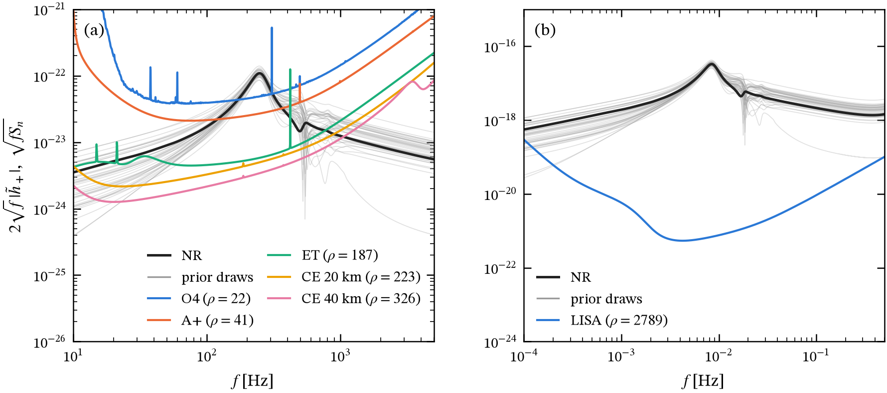
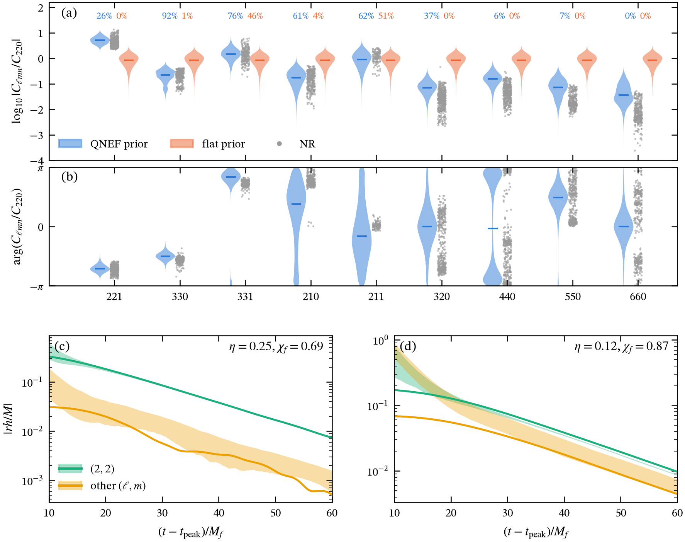

Findings under the v2 model (complex strain, tied mirror modes, detector noise), newest first. The v1 plots were retired on 2026-09-24; their numbers remain in the [log](#log).

Each finding is self-contained:

- **Question**: what the figure is meant to answer.
- **Figure**: click to open it at full size.
- **Takeaway**: the one or two sentences to remember.
- **Setup**: source, detector, prior, mode content.
- **Reproduce**: script and commit.

### F3 — A GW250114-like ringdown against the detector sensitivities (2026-09-24, real SXS strain, every mode)

<figure>

<figcaption>$2\sqrt f\,|\tilde h_+(f)|$ against $\sqrt{f S_n(f)}$ (Moore, Cole &amp; Berry convention). Black: the real SXS:BBH:0180 strain (equal mass, non-spinning, $\chi_f = 0.686$), all harmonics $\ell \le 8$, $m \ne 0$, at $\iota = 0.78$, from $t_0$ on. Grey: 40 QNEF-prior draws of every mode ($\ell \le 8$, $n \le 7$) conditioned on the 220 fitted to that strain. Panels (a) and (b) start at $5\,M$ and $10\,M$ after the peak. $h_+$ for $F_+ = 1$; 60° interferometers at their best orientation. ρ is the optimal single-detector SNR of the NR strain.</figcaption>
</figure>

**Question.** How does a GW250114-like ringdown sit against current and future detectors, and does the QNM model with our prior reproduce the real strain?

**Takeaway.**

- **With the real strain, the SNR is right.** O4 gives an optimal ρ = 35 from the peak, consistent with LVK's network value of about 40 post-merger, and 22 from $10\,M$. The earlier version injected the jaxqualin QNM fit, which is about 10× too loud at the peak and gave ρ = 120.
- **From $5\,M$ (a), the all-mode draws scatter well above the real strain,** below 100 Hz and above 400 Hz. From $10\,M$ (b) they bracket it (see F2 for the coverage numbers).
- **Optimal SNRs from $5\,M$:** O4 27, A+ 48, ET-D 223, CE 20 km 266, CE 40 km 389. From $10\,M$: 22, 41, 187, 223, 326. From the peak, O4 gets 35. For a $10^6\,M_\odot$ remnant at $z = 1$, LISA gets about 2800 per channel from $10\,M$.

**Caveats.** $\varphi$ is set to 0 and $\iota$ is the folded value. $D_L = 405$ Mpc comes from $z = 0.086$. $m = 0$ harmonics are left out. 

**Reproduce.** `python -m mqnm.experiments.sensitivity_overlay` (downloads SXS:BBH:0180 through `sxs`).

### F2 — Do the calibrated priors actually cover NR? (2026-09-24; strain row added)

<figure>

<figcaption>Rows 1–2: for each SXS run, both priors conditioned on that run's own 220 predict $C_j/C_{220}$ at the merger. Violins pool the predictions and grey dots are NR; the numbers give the fraction of runs inside *their own* 90% interval (blue: QNEF, orange: flat). Row 3: the NR strain for SXS:BBH:0180 (GW250114-like) and SXS:BBH:1437 ($q \approx 6$, $\chi_f = 0.87$) against 5–95% bands from 200 draws of **every mode** ($\ell \le 8$, $n \le 7$) of the QNEF prior, conditioned on the 220 fitted to that strain. The two quantities are $|h_{22}|$ and the rms of all other $m > 0$ harmonics.</figcaption>
</figure>

**Question.** With the calibrated errors, are the priors consistent with NR, both per mode and for the total strain?

**Takeaway.**

- **Per mode:** the QNEF prior covers the 221, 330, 331, 210 and 211 (81–99%). It overpredicts the moduli of the 320, 440, 550 and 660 (12–63%), where PN is biased. The flat prior is miscalibrated almost everywhere.
- **Total strain, coverage across 30 SXS runs** (fraction of NR samples inside the prior's 90% band):

| window after the peak | $h_{22}$ | other harmonics | prior / NR for $\lvert h_{22} \rvert$ |
|---|---|---|---|
| 5–10 M | 61% | 2% | 1.78 (10–90%: 1.18–4.49) |
| 10–15 M | 83% | 33% | 1.06 |
| 15–20 M | 95% | 59% | 0.98 |
| 20–25 M | 72% | 68% | 0.97 |

- **Before about 10 M the prior predicts too much strain.** This comes mostly from the *jaxqualin-calibrated* overtones: jaxqualin measures their amplitudes where they are stable (10–15 M) and quotes them back at the peak, and at 5 M the real waveform is not yet described by them. Starting at 5 M would therefore overcount measurable channels. **10 M is the earliest start at which the prior is consistent with NR.**
- The other harmonics stay under-covered at late times, because NR contains content the model lacks (e.g. the quadratic 220×220 in $h_{44}$).

**Reproduce.** `python -m mqnm.experiments.prior_vs_nr` (downloads two SXS runs).

### F1 — Is the analytic prior right, and how wrong is the flat one? (2026-09-24, revised for the conditioned prior)

<figure>

<figcaption>Each dot is one SXS run; a perfect prediction sits at phase 0, modulus 1. (a) Overtone ratios $C_{\ell m1}/C_{\ell m0}$ over the QNEF $g$. (b) Fundamental ratios $C_{\ell m0}/C_{220}$ over the complex PN $w$, after rotating each run into the PN frame. (c) $|C_{\ell mn}/C_{220}|$, which the flat prior sets to 1; diamonds are the rms values.</figcaption>
</figure>

**Question.** Does the analytic PN × QNEF prior describe NR ringdowns at the merger, in modulus *and phase*, and how large are its errors compared with a flat prior's?

**Takeaway.**

- **Overtones:** the QNEF phase is right. The 221/220 median phase error is $-0.01$ rad, with 0.11 rad scatter over 457 runs, and the modulus is within about 20%. Calibrated errors: $f_{221} = 0.22$, $f_{331} = 0.29$, $f_{211} = 0.90$ (NR is about 1.8× the prediction).
- **Fundamentals:** PN gets the 330 relative to the 220 right in phase ($-0.19$ rad, interquartile range 0.14 rad) and modulus (1.03), so $e_{33} = 0.29$. For the 210, NR is biased by 1.9× and $+0.8$ rad, since leading-order PN has no spin term; $e_{21} = 2.1$. The 440 is barely predictable ($e_{44} = 1.0$, with two phase clusters) and so, in effect, decouples from the 220.
- **Flat prior:** it is off by up to two decades. The 221 is $5\times$ the 220; the 660 is $0.014\times$.

**Setup.** jaxqualin SXS catalogue, 500 runs with $\chi_f \ge 0$, amplitudes at the peak of $|h_{22}|$, spheroidal-corrected, 5σ outlier rejection, PN at $v = 0.7$.

**Reproduce.** `python -m mqnm.experiments.nr_calibration`, which also writes `mqnm/data/nr_calibration.json`.
