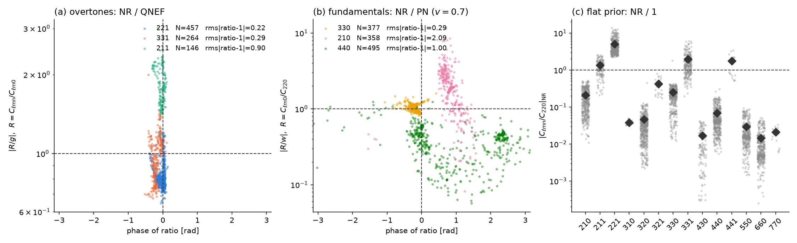

Findings under the v2 model (complex strain, tied mirror modes, detector noise), newest first. The v1 plots were retired on 2026-09-24; their numbers remain in the [log](#log).

Each finding is self-contained:

- **Question**: what the figure is meant to answer.
- **Figure**: click to open it at full size.
- **Takeaway**: the one or two sentences to remember.
- **Setup**: source, detector, prior, mode content.
- **Reproduce**: script and commit.

### F1 — Is the analytic prior right, and how wrong is the flat one? (2026-09-24, revised for the conditioned prior)

<figure>

<figcaption>Each dot is one SXS run; a perfect prediction sits at phase 0, modulus 1. (a) Overtone ratios $C_{\ell m1}/C_{\ell m0}$ over the QNEF $g$. (b) Fundamental ratios $C_{\ell m0}/C_{220}$ over the complex PN $w$, after rotating each run into the PN frame. (c) $|C_{\ell mn}/C_{220}|$, which the flat prior sets to 1; diamonds are the rms values.</figcaption>
</figure>

**Question.** Does the analytic PN × QNEF prior describe NR ringdowns at the merger, in modulus *and phase*, and how large are its errors compared with a flat prior's?

**Takeaway.**

- **Overtones:** the QNEF phase is right. The 221/220 median phase error is $-0.01$ rad, with 0.11 rad scatter over 457 runs, and the modulus is within about 20%. Calibrated errors: $f_{221} = 0.22$, $f_{331} = 0.29$, $f_{211} = 0.90$ (NR is about 1.8× the prediction).
- **Fundamentals:** PN gets the 330 relative to the 220 right in phase ($-0.19$ rad, interquartile range 0.14 rad) and modulus (1.03), so $e_{33} = 0.29$. For the 210, NR is biased by 1.9× and $+0.8$ rad, since leading-order PN has no spin term; $e_{21} = 2.1$. The 440 is barely predictable ($e_{44} = 1.0$, with two phase clusters) and so, in effect, decouples from the 220.
- **Flat prior:** it is off by up to two decades. The 221 is $5\times$ the 220; the 660 is $0.014\times$.

**Setup.** jaxqualin SXS catalogue, 500 runs with $\chi_f \ge 0$, amplitudes at the peak of $|h_{22}|$, spheroidal-corrected, 5σ outlier rejection, PN at $v = 0.7$.

**Reproduce.** `python -m mqnm.experiments.nr_calibration`, which also writes `mqnm/data/nr_calibration.json`.
