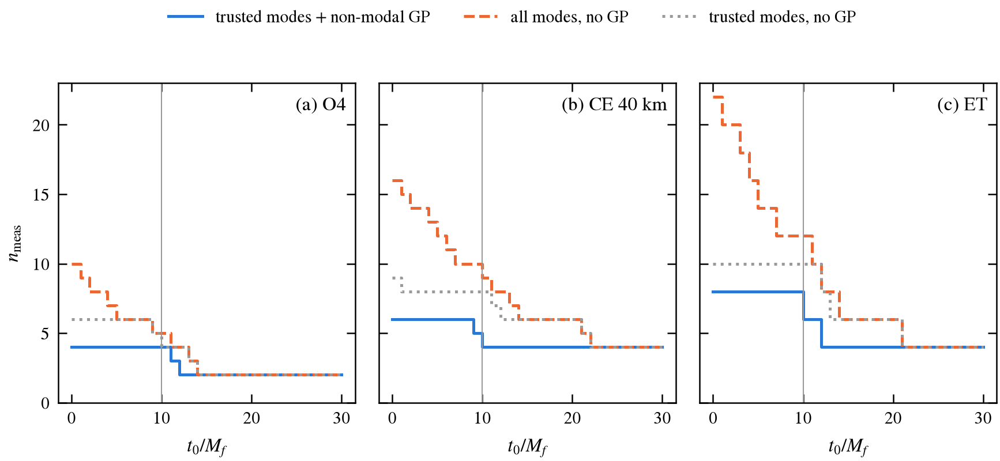

Findings under the v2 model (complex strain, tied mirror modes, detector noise, NR-calibrated priors), newest first. Every analysis starts at $t_0 = 10\,M_f$ after the peak of $|h_{22}|$ unless stated. The v1 plots and the earlier F1 (the calibration scatter) are retired; their numbers remain in the [log](#log).

### F7 — Does the count depend on how the noise covariance is built? (unverified)

$n_{\rm meas}$ for all 280 modes ($\ell \le 8$, $n \le 7$) from $t_0 = 10\,M_f$, PN × QNEF prior (flat prior with the same total SNR in brackets). Ground: the GW250114-like source at its distance. LISA: $10^6\,M_\odot$ at $z = 1$. Each row changes one choice in the covariance of [derivations §7](#derivations).

| choice | O4 | CE 40 km | ET | LISA |
|---|---|---|---|---|
| as published (F3), earlier prior | 5 (19) | 11 (36) | 14 (56) | 25 (74) |
| time step $0.05$ / $0.2\,M$ instead of $0.1\,M$ | 5 / 5 | 11 / 11 | 14 / 14 | 25 / 25 |
| PSD continued as a power law above its table | 5 (19) | 11 (36) | 14 (56) | — |
| 16× finer frequency grid for the ACF | 5 (19) | 11 (36) | 14 (56) | 25 (74) |
| $10^6\times$ more noise below $f_{\rm low}$ | 5 (18) | 11 (36) | 14 (56) | 25 (74) |
| band-limited at 4096 Hz | 5 (19) | 11 (36) | **12** (56) | — |

With the current amplitude prior (2026-09-27) the reference counts are 5 (19), 9 (36), 12 (56) and 22 (74); the rows above used the earlier prior and will be rerun with it.

**Takeaway.**

- **The published counts stand.** No numerical choice moves $n_{\rm meas}$ by more than one channel, at the source or at $\rho_{220} = 100$ and $1000$. The time step is converged, and $\rho_{220}$ changes by less than 1%.
- **The analysis bandwidth is the one choice that matters.** Cutting at 4096 Hz, as a detector sampled at 8192 Hz would, costs ET two channels (and CE, O4 one at $\rho_{220} = 1000$). The heavily damped overtones have broad spectra that reach into the kHz band. We keep the full Nyquist range of the $0.1\,M$ grid (about 15 kHz at $68\,M_\odot$).
- **The noise below $f_{\rm low}$ has no correct value.** More noise there lowers every channel strength by 1–2% per decade, without converging, and lowers $\rho_{220}$ by 2–6% at $10^6\times$. We keep the flat hold as a mildly optimistic default ([§7](#derivations)).
- The covariance itself passes every check: white noise, direct quadrature, and simulated coloured noise, with a doubled covariance rejected at more than 100σ as the control.

**Reproduce.** `python tasks/t08-detector-noise/S2/sweep.py` and `S1/acf_checks.py` in the project repository, with the `mqnm` package.

### F6 — How does the count depend on the start time? A non-modal GP

> **Withdrawn (2026-09-25).** This version restricts the signal to the modes jaxqualin can extract (about 40). That conflicts with the goal: the *theoretical* maximum number of measurable modes, out of a very large mode set. The GP idea stays; it will be redone with the full mode set.

<figure>

<figcaption>$n_{\rm meas}$ against the start time $t_0$ for the GW250114-like source at its distance. Blue: trusted modes (fundamentals + overtones NR sees) with the non-modal Gaussian process added to the noise ([derivations §10](#derivations)). Orange: every mode ($\ell \le 8$, $n \le 7$, unseen overtones zero-mean), no GP. Grey: trusted modes, no GP. The vertical line is the current default start, $10\,M$.</figcaption>
</figure>

**Takeaway.**

- **Without the GP, starting earlier keeps adding channels:** O4 goes from 5 to 10 and ET from 12 to 22 between $t_0 = 10$ and 0. The free overtones absorb the non-modal content near the merger and are counted as modes.
- **With the GP, the count is flat for any start before about 10 M:** O4 4, CE 40 km 6, ET 8. Early data are down-weighted by the non-modal noise, so the answer no longer depends on the arbitrary choice of $t_0$, and we could start at the merger.
- The late GP term (12% of each harmonic, decaying with it) changed the counts by at most 1 with the earlier calibration (14%); not rechecked. The effect comes from the early term plus restricting the signal to trusted modes.

**Reproduce.** `python -m mqnm.experiments.start_time`.

### F5 — Two-mode toy model: what 0, 1 and 2 measurable channels look like

<figure>

<figcaption>Prior (dashed, 1σ and 2σ) and posterior (filled, 1σ and 2σ) of two real amplitudes $(a_1, a_2)$ for per-mode SNR $\rho = 0.2, 2, 8$ (columns). The data overlap is $c = 0.864$, the 220–221 value at $\chi_f = 0.686$. Top: flat prior. Bottom: correlated prior, $r = 0.8$. The star is the true value, and each panel gives the channel strengths $s_\pm$, with $s_\pm^2 = \rho^2 (1 \pm r)(1 \pm c)$ exactly ([derivations §9](#derivations)).</figcaption>
</figure>

**Takeaway.**

- **Flat prior:** no channels at $\rho = 0.2$; the posterior is the prior. One at $\rho = 2$: the sum $a_1 + a_2$ is measured and the difference is not. Both at $\rho = 8$. Resolving two overlapping damped modes needs $\rho > 1/\sqrt{1 - c} = 2.7$.
- **Correlated prior:** again nothing at $\rho = 0.2$. The prior already ties $a_1$ to $a_2$, so resolving the difference needs $\rho > 6.1$. At $\rho = 2$ the posterior is compact with only one measurable channel. $n_{\rm meas}$ counts what the *data* teach us; the prior supplies the rest.

**Reproduce.** `python -m mqnm.experiments.toy_two_modes`.

### F4 — Does the number of channels saturate as modes are added?

<figure>

<figcaption>$n_{\rm meas}$ (real channels) for nested mode sets: left, overtones $n \le n_{\max}$ with all $\ell \le 8$; right, harmonics $\ell \le \ell_{\max}$ with all $n \le 7$. GW250114-like source (equal mass, $\chi_f = 0.686$, $\iota = 0.78$), CE 40 km, from $t_0 = 10\,M_f$. Shades: $\rho_{220} = 30, 300, 3000$. Top: flat prior, with its scale fixed so that the full model has the same expected total SNR as the PN + QNEF prior. Bottom: PN + QNEF prior.</figcaption>
</figure>

**Takeaway.**

- **Overtones saturate early.** With the PN + QNEF prior the count stops at $n_{\max} = 1$ for $\rho_{220} = 30$ and at 2 for 3000; at 300 one more channel appears at $n_{\max} = 4$. With the flat prior the count is flat from $n_{\max} = 1$. From $10\,M$ the higher overtones have decayed below reach.
- **Harmonics saturate with the PN + QNEF prior:** from $\ell_{\max} = 2$ at $\rho_{220} = 30$ (4 channels) and by 6 at 3000 (16). At 300 the count reaches 8 at $\ell_{\max} = 4$ and gains one more at 8.
- **With a flat prior the count grows linearly in $\ell_{\max}$ and never saturates.** Saturation comes from the physical amplitude hierarchy, not from the noise.

**Reproduce.** `python -m mqnm.experiments.saturation`.

### F3 — How many channels can be measured? Per detector, vs SNR and redshift

<figure>

<figcaption>$n_{\rm meas}$ (real channels; each complex mode amplitude has two, so the 220 alone counts as 2) from $t_0 = 10\,M_f$, every mode $\ell \le 8$, $n \le 7$. (a, d) Against the 220's expected optimal SNR $\rho_{220}$, for the GW250114-like source (LISA: $10^6\,M_\odot$ at $z = 1$). (b, e) The GW250114-like source moved in redshift; the grey line is GW250114 ($z = 0.086$). (c, f) LISA remnants of $10^5$ (dotted), $10^6$ (solid) and $10^7\,M_\odot$ (dashed) against their redshift. Top: flat prior with the same expected total SNR as the PN + QNEF prior. Bottom: PN + QNEF prior. In (a, d) CE 40 km (dashed) coincides with O4, and LISA (dashed) with ET: the count depends only on $\rho_{220}$ and on whether one or both polarizations are seen. Networks: O4 and A+ as two co-aligned LIGO detectors (one polarization); ET as a triangle of three 60° interferometers; CE as a single L; LISA as the A and E channels. The source is overhead, $\psi = 0$.</figcaption>
</figure>

**Takeaway.**

- **GW250114 at its distance, PN + QNEF prior:** O4 5, A+ 6, CE 20 km 8, CE 40 km 9, ET 12. That is, the 220 plus 3 (O4) to 10 (ET) further real channels. With the earlier prior these were 5, 6, 10, 11, 14.
- **Growth with SNR is roughly logarithmic:** 2 channels at $\rho_{220} = 10$, 6 at 100, 12–16 at 1000 and 22–28 at $10^4$. Above $\rho_{220} \approx 500$, networks that see both polarizations (ET, LISA) pull ahead.
- **Third-generation detectors keep 4–6 channels out to $z \sim 5$**, because the redshifted mass moves the ringdown into their low-frequency band. O4 and A+ drop to the 220 alone (2) by $z \approx 1$.
- **LISA:** a $10^6\,M_\odot$ remnant keeps about 20–22 channels from $z \approx 1$ to 10, and 14 at $z = 20$. A $10^7\,M_\odot$ remnant gives more at low redshift (51 at $z = 0.1$) and falls below $10^6$ beyond $z \approx 5$, as its ringdown drops out of the band. A $10^5\,M_\odot$ remnant gives only 4–6 channels, and its count rises again beyond $z \approx 3$ as redshift moves its ringdown (about 0.15 Hz) down into the most sensitive band. At those frequencies our long-wavelength LISA response is not accurate; the exact response is a planned check.
- **At equal total SNR, the flat prior gives 3–5× more channels** (O4 19, CE 40 km 36, ET 56, LISA 74 at the source). The PN + QNEF structure concentrates the signal into a few correlated directions, so the measurability count depends strongly on what we know about the amplitudes.

**Caveats.** An overhead source with co-located detectors is an idealisation. The PN + QNEF prior under-covers (3,2) and (4,3) and over-covers (3,3) (F1). The count is of *channels* (combinations of amplitudes), not of named modes.

**Reproduce.** `python -m mqnm.experiments.measurability`.

### F2 — A GW250114-like ringdown against the detector sensitivities

<figure>

<figcaption>Characteristic strain $2f\,|\tilde h_+(f)|$ of the ringdown against the noise amplitude $\sqrt{f S_n(f)}$ (Moore, Cole &amp; Berry convention: both dimensionless, and $\rho^2 = \int (2f|\tilde h|/\sqrt{fS_n})^2\,d\ln f$), from $t_0 = 10\,M_f$. Black: the SXS:BBH:0180 strain (equal mass, non-spinning, $\chi_f = 0.686$; all harmonics $\ell \le 8$, $m \ne 0$; $\iota = 0.78$). Grey: 5–95% band of 200 draws of every mode ($\ell \le 8$, $n \le 7$) from the PN + QNEF prior conditioned on the fitted 220. (a) GW250114 scaling: $M_f^{\rm det} = 68.1\,M_\odot$, $D_L = 406$ Mpc. (b) $M_f = 10^6\,M_\odot$ at $z = 1$, one LISA channel. $h_+$ for $F_+ = 1$; ET and LISA (60° interferometers) at their best orientation. The signal curves stop at $3f_{220}$ (750 Hz; 0.026 Hz for LISA): above it the spectrum is the window edge, not ringdown content. Optimal single-detector SNR of the NR strain from $10\,M$ (full band): O4 22, A+ 41, ET 187, CE 20 km 223, CE 40 km 326, LISA 2789.</figcaption>
</figure>

**Takeaway.**

- The prior band brackets the real strain.
- Optimal SNRs from $10\,M$: O4 22, A+ 41, ET 187, CE 20 km 223, CE 40 km 326; LISA about 2800 per channel.
- **The signal curves stop at $3f_{220}$.** Beyond it the spectrum of a signal switched on at $t_0$ is flat, $2f|\tilde h| \to |h(t_0)|/\pi$: the sharp start of the window, not ringdown content or NR noise. That plateau matches $|h_+(t_0)|/\pi$ to 2%, shows up in the analytic prior draws too, and drops 20-fold when the start is tapered over $2\,M$. The spectrum still falls steeply at $2f_{220}$ and is flat by $3f_{220}$. Above the cut lies 0.8–1.2% of $\rho^2$ in every detector.
- *Correction (2026-09-28):* earlier versions of this plot drew $2\sqrt f\,|\tilde h_+|$ against $\sqrt{fS_n}$, which put the noise curves off by $\sqrt f$ relative to the signal. The SNRs were computed correctly and do not change.
- From the peak, O4 gets 35, in line with LVK's network value of about 40 post-merger.

**Caveats.** $\varphi = 0$; $\iota$ is the folded value; $m = 0$ harmonics are left out; $D_L$ comes from $z = M_f^{\rm det}/M_f - 1$.

**Reproduce.** `python -m mqnm.experiments.sensitivity_overlay`.

### F1 — Do the calibrated priors cover NR?

<figure>

<figcaption>Amplitude ratios $C_j/C_{220}$ at the merger, (a) modulus and (b) phase. For each SXS run the prior is conditioned on that run's own 220 and predicts the ratio; violins pool these predictions over runs. Blue: the PN + QNEF prior (1PN at the run's own $v_{\rm peak}$, four calibrated numbers, [derivations §8](#derivations)). Orange: the flat prior (every mode independent with the 220's scale; its phase is uniform and not shown). Dots: NR (jaxqualin). Only the 150 runs held out of the calibration are used, so the prior never saw these data.</figcaption>
</figure>

**Takeaway.**

- **The PN + QNEF prior tracks NR mode by mode.** Coverage of $|C_j/C_{220}|$ in each run's own central 68% interval (target 68%): 221 87%, 440 70%, 550 74%, 660 68%, 211 62%, 210 59%. The flat prior covers 0–2% for every fundamental and the 221.
- **One pooled error $e$ is too wide for (3,3) and too narrow for (3,2) and (4,3).** 330 and 331: 99–100%. 320: 41%; 430: 37% (43 runs). NR's (3,3) sits at 1.9× the 1PN prediction at $v_{\rm peak}$, and $e$ has to reach it ([§8.4](#derivations)).
- **The 221 is now covered** (87%; 26% with the earlier per-mode prior). The calibrated factor $\kappa = 0.77$ carries NR's offset of about 0.8 from the QNEF ratio.
- **Phases:** the 221 is predicted tightly and matches NR; the 330's broader prediction is centred on NR. NR's phase sits about 1 rad from the prior's circular mean for the 210 and 211, and 0.5 rad for the 331. For the 320, 440 and 660, NR splits into two groups that the prior does not resolve.
- **The default start of 10 M** comes from an earlier check of the total strain against the earlier prior (5–10 M after the peak the prior predicted 1.8× too much $|h_{22}|$; from 10 M it was within 6%). It has not been redone with this prior.

**Reproduce.** `python -m mqnm.experiments.prior_vs_nr`.
