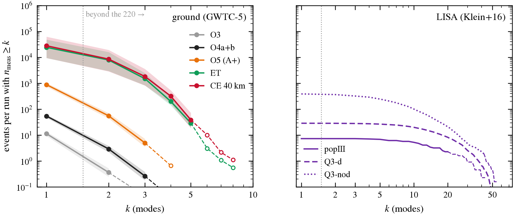
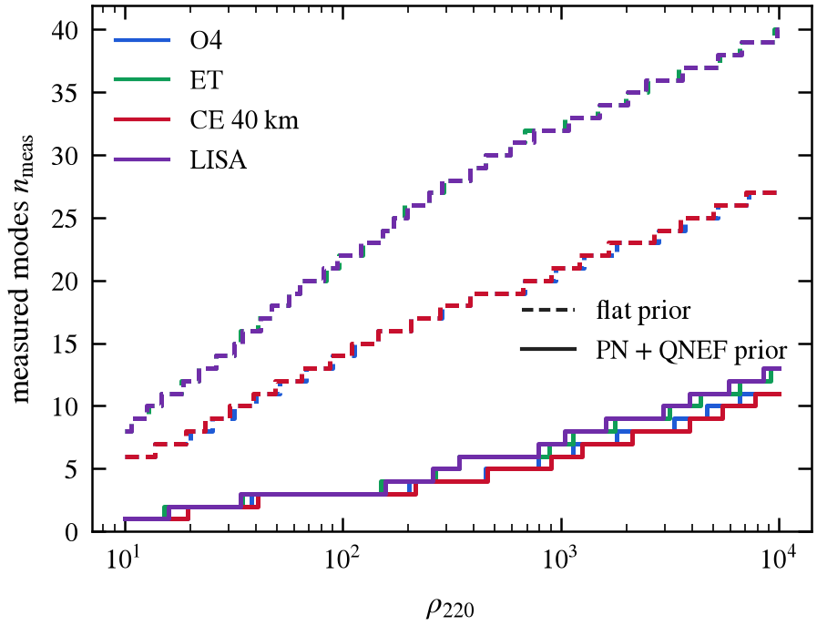
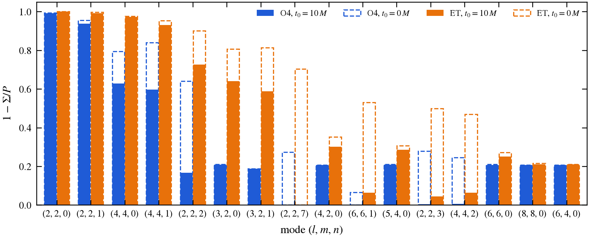
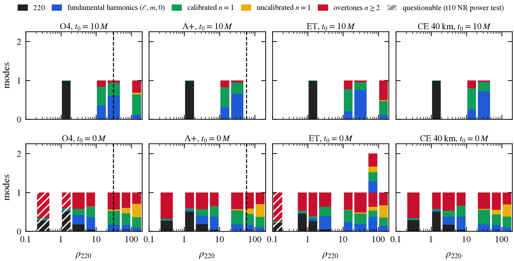
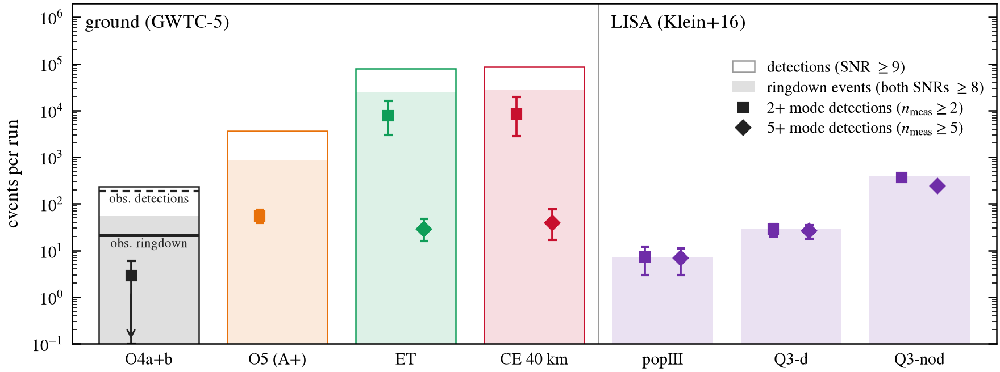
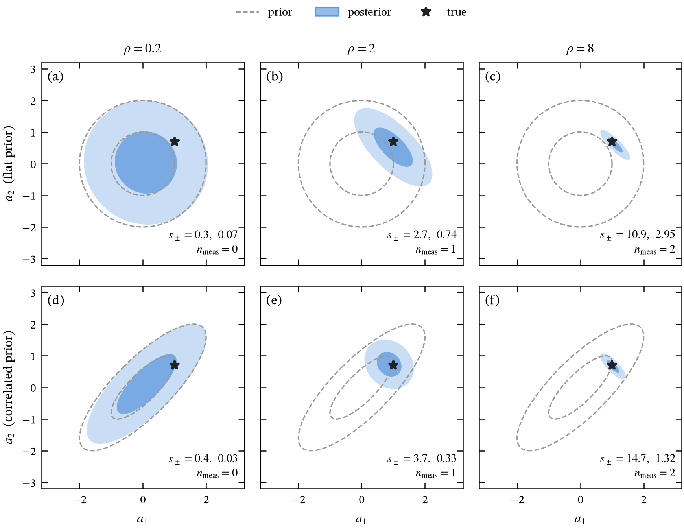
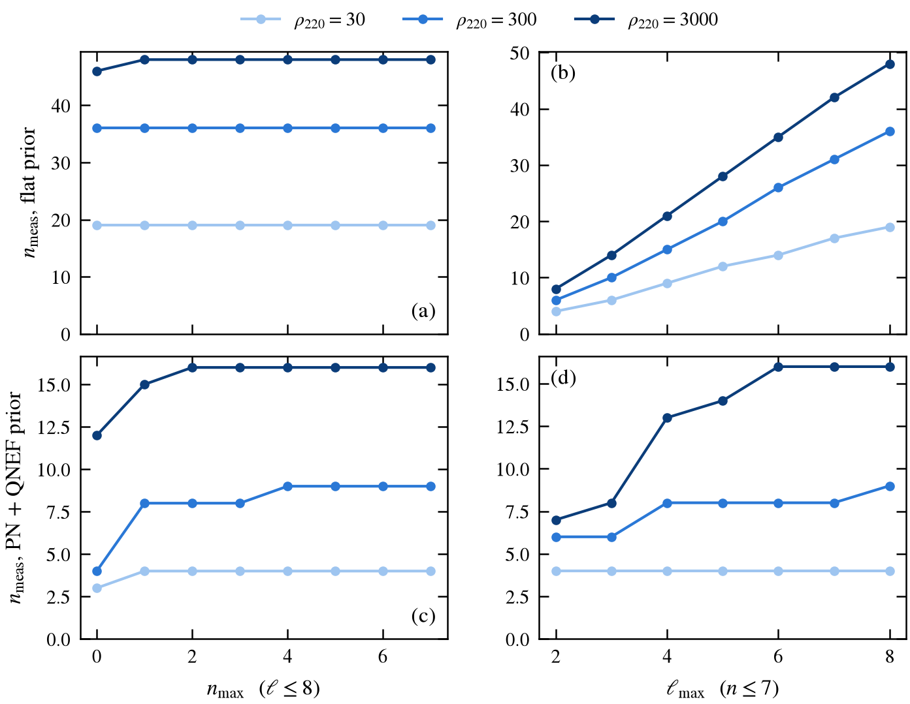
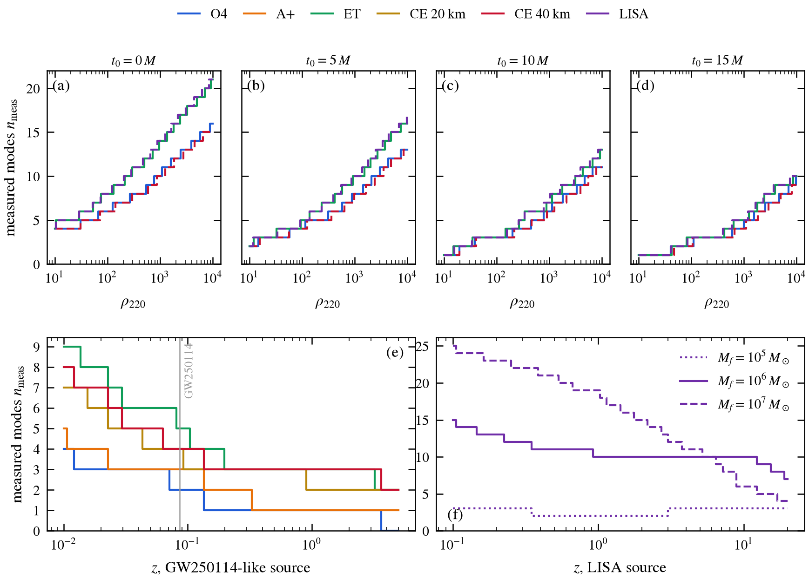
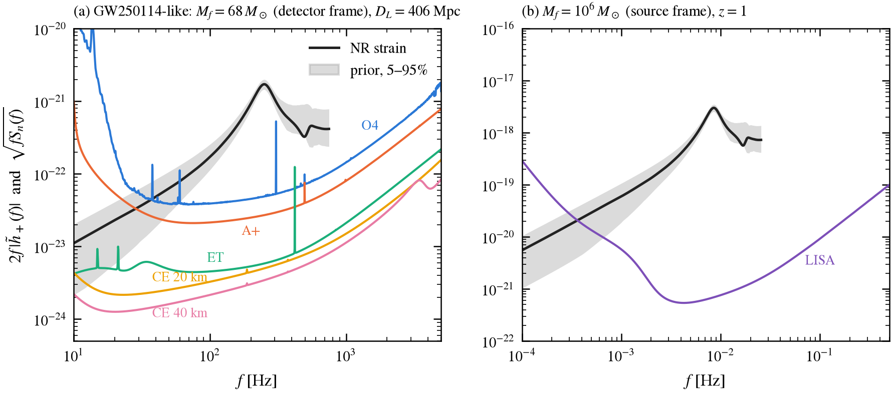
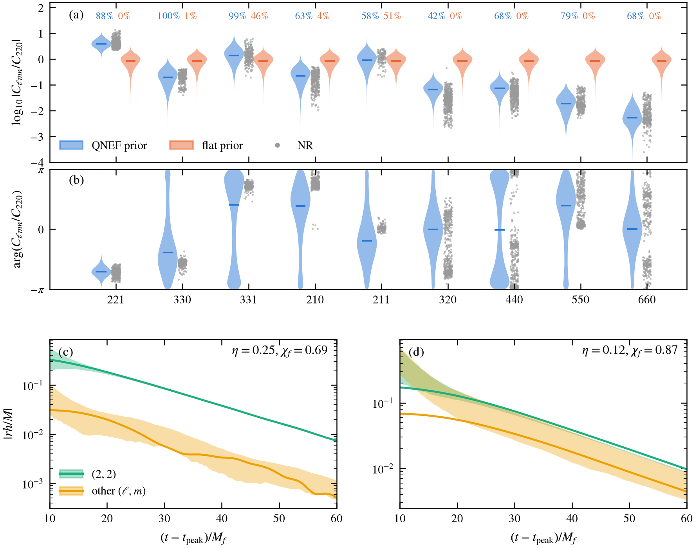

Findings, newest first. Unless stated, every analysis starts at $t_0 = 10\,M_f$ after the peak of $|h_{22}|$, uses all 280 modes ($\ell \le 8$, $n \le 7$) and the PN × QNEF prior with untied-overtone scale $a = 1$ ([§8](#derivations)). **Counts are in modes:** the amplitudes enter as real and imaginary parts, so every mode has two real channels, and we report $n_{\rm meas} = \lfloor n_{\rm ch}/2 \rfloor$, where $n_{\rm ch} = \#\{s_k > 1\}$. A mode counts once both its quadratures are measured. Retired plots and superseded numbers remain in the [log](#log).

### F12 — How many events per run measure at least $k$ modes? (unverified)

<figure><figcaption>Expected number of events in one run with $n_{\rm meas} \ge k$ measured modes (log), against $k$ (log). The 220 alone gives $k = 1$; the dotted line marks "beyond the 220". Left: ground networks with the GWTC-5 population (Madau–Dickinson redshift history, 500 hyperposterior draws). O3 grey (0.75 yr), O4a+b black (real noise, 0.89 yr), O5 = A+ orange (2 yr), ET green (1 yr), CE 40 km red (1 yr). Lines and dots: mean over draws. Bands: 90% interval of the expected count. Dashed with open dots: fewer than 10 pool events carry the count. Right: LISA with the Klein+16 popIII (solid), Q3-d (dashed) and Q3-nod (dotted) models, 4 yr. Every count uses ringdown events (SNR ≥ 8 in both inspiral and post-inspiral, the LVK pSEOBNR selection). Choices in [§12](#derivations).</figcaption></figure>

**Takeaway.**

- **On the ground, each extra mode costs a factor of 3–8 in rate.** ET: 24 000 events a year with the 220, 7900 with two modes, 1500 with three, 200 with four, 29 with five.
- **O4a+b expects about 3 two-mode events** (90%: 0–6), consistent with GW250114. A+ expects 55 in 2 yr.
- **LISA events are few, but each measures tens of modes**: the Q3-nod curve stays flat out to 10 modes.

**Reproduce.** `python tasks/t11-money-plots/S1/m5_figures.py <pools> tasks/t07-population-counts/S7/counts_gwtc5md.json <out> <date>`. It reads the t07 counts and changes no number.

### F11 — How much does the PN × QNEF prior change the count? (unverified)

<figure><figcaption>Measured modes $n_{\rm meas}$ against the 220's expected SNR $\rho_{220}$ (log), GW250114-like source (LISA: $2\times10^6\,M_\odot$ detector frame). Colours: O4 blue, ET green, CE 40 km red, LISA purple. Dashed: flat prior, every mode independent, with its scale set so that its expected total SNR equals the PN × QNEF prior's. Solid: PN × QNEF prior. The flat curves of O4 and CE 40 km coincide, and so do those of ET and LISA.</figcaption></figure>

**Takeaway.**

- **The flat prior counts 3–8× more modes at the same $\rho_{220}$.** At $\rho_{220} = 10$ it counts 6–8 modes, against 1 under PN × QNEF. At 3000 it counts 24–36, against 8–10.
- **Under PN × QNEF every network gives nearly the same count.** Under the flat prior the count splits by how many polarizations the network sees.
- The flat prior assumes fundamental amplitudes one to two decades above NR (F1), so NR does not support its extra modes.

**Reproduce.** `python tasks/t11-money-plots/S1/m2.py <date>`, with the `mqnm` package (`mqnm.experiments.measurability.prior_value`).

### F10 — Which mode amplitudes does a GW250114-like ringdown pin down? (unverified)

<figure><figcaption>For each mode $j$, $1 - \Sigma/P$, the fraction of its prior variance the data remove. $\Sigma = \Sigma_{jj}$ is the posterior variance and $P = P_{jj}$ the prior variance of its amplitude, with real and imaginary parts summed; 1 means the amplitude is known exactly and 0 that nothing is learned. The 16 modes shown are the best measured in any of the four cases, ordered by ET. Blue: O4; orange: ET. Filled: $t_0 = 10\,M$; dashed outline: $t_0 = 0$. GW250114-like source at its distance, detector noise only. A bar near 0.21 means that the mode itself is not measured: a fundamental learns that much only because its prior amplitude is tied to $A_{220}$, which the data fix.</figcaption></figure>

**Takeaway.**

- **O4 pins down the 220 and the 221** (99% and 94% of the prior variance removed) and about 60% of the 440 and 441.
- **ET adds the 222, 320 and 321** (59–73%) **and nearly fixes the 440 and 441** (93–97%).
- **Starting at the peak adds high overtones**: the 227 (70%), 223 (50%) and 661 (53%) in ET. These are the uncalibrated overtones behind the modes gained at early $t_0$, and they are the ones flagged questionable in F9.

**Reproduce.** `python tasks/t11-money-plots/S2/figures.py <date>`, from the posterior covariances of `tasks/t10-channel-reliability/S1`.

### F9 — In which order do the modes enter as the source gets louder? (unverified)

<figure><figcaption>One histogram per detector (columns: O4, A+, ET, CE 40 km) and start time (top: $t_0 = 10\,M$; bottom: $t_0 = 0$). x: the 220 SNR $\rho_{220}$ at which a mode enters, meaning its second channel crosses $s > 1$, binned from 0.1 to 200. y: number of modes entering per bin. Each mode's bar is split by where its two channels point in the prior's independent factors. Black: the 220. Blue: the fundamental harmonics $(\ell, m, 0)$. Green: the calibrated $n = 1$ overtones (221, 211, 321, 331, 441, tied to NR). Yellow: the uncalibrated $n = 1$ overtones. Red: overtones $n \ge 2$. Hatched: modes into which noise-free NR strain from 434 SXS runs puts less than a quarter of the prior-claimed power (tested for O4 and ET). Dashed line: the GW250114-like source; the modes left of it are measured. For ET and CE 40 km the source ($\rho_{220} = 321$, $335$) is beyond the axis.</figcaption></figure>

**Takeaway.**

- **From $10\,M$ the order is the same in every detector.** First the 220 ($\rho_{220} \approx 1.7$). Then a mode made mostly of calibrated $n = 1$ overtones (15–19). Then one made mostly of the fundamental harmonics (35–40). A fourth arrives near 150–215.
- **GW250114 measures 2 modes in O4, 3 in A+, 5 in ET and 4 in CE 40 km** from $10\,M$; from the peak, 5, 5, 11 and 8.
- **From the peak every mode carries $n \ge 2$ overtones**, and the earliest ones (two in O4, one in ET) fail the NR power test. The prior over-claims there, which is why we quote counts from $10\,M$.

**Reproduce.** `python tasks/t11-money-plots/S2/content.py` (channel make-up), then `S2/figures.py <date>`.

### F8 — How many 2+ and 5+ mode detections will each detector generation see? (unverified)

<figure><figcaption>Events per run on a log scale. Outline bar: detections (network SNR ≥ 9). Filled bar: ringdown events (SNR ≥ 8 in both the inspiral and the post-inspiral part, the LVK's pSEOBNR selection). Markers: expected numbers of ringdown events with $n_{\rm meas} \ge 2$ modes (squares) and $\ge 5$ modes (diamonds), with 90% intervals over population draws and Poisson scatter. A marker is missing when its count is below 0.1, as for O5's 5+ mode detections, which no pool event reaches. The black lines on O4a+b are the observed detections (190 BBH with FAR &lt; 1/yr) and the observed ringdown events (21 analysed with pSEOBNR). Ground: GWTC-5 BP2P with a Madau–Dickinson redshift history (draws whose rate falls after the peak). LISA: Klein+16 catalogues. Runs: O4a+b 0.891 yr of real two-detector time and real noise; O5 = LIGO A+ design curve, 2 yr; ET and CE 40 km 1 yr; LISA 4 yr. All choices are in [§12](#derivations).</figcaption></figure>

| run | detections (SNR ≥ 8) | ringdown events | 2+ modes | 5+ modes |
|---|---|---|---|---|
| O4a+b, 0.891 yr | 329 [283, 377] | 54 [41, 69] | 2.9 [0, 6] | 0 (no pool event) |
| O5 (A+), 2 yr | 4960 [3740, 6330] | 882 [734, 1037] | 55 [39, 75] | 0 (no pool event) |
| ET, 1 yr | $8.4\times10^4$ [$2.7\times10^4$, $1.9\times10^5$] | $2.4\times10^4$ | 7900 [3000, 16000] | 29 [16, 47] |
| CE 40 km, 1 yr | $8.9\times10^4$ [$2.6\times10^4$, $2.1\times10^5$] | $2.8\times10^4$ | 8500 [2900, 19300] | 39 [17, 76] |
| LISA popIII, 4 yr | 192 | 7.3 [3, 12] | 7.3 [3, 12] | 6.9 [3, 11] |
| LISA Q3-d, 4 yr | 32 | 29 [20, 38] | 28 [20, 37] | 26.5 [18, 35] |
| LISA Q3-nod, 4 yr | 474 | 387 [354, 419] | 365 [334, 396] | 245 [219, 271] |

**Takeaway.**

- **O5 should see 55 [39, 75] 2+ mode detections in 2 yr.** O4a+b expects 2.9 [0, 6], consistent with the one observed (GW250114). No ground detector before the next generation reaches five modes.
- **ET and CE 40 km give 30–40 5+ mode detections a year**, and thousands of 2+ mode detections. Their intervals span a factor of 5–10 because the high-redshift rate is uncertain.
- **LISA's heavy-seed populations measure five or more modes in almost every ringdown it sees.** Light seeds (popIII) give a handful, because their ringdowns mostly lie above the LISA band.
- **Against observations:** O3 matches (detections 57 vs 59, ringdown events 11 vs 10, two-mode events 0.4 vs 0). O4a+b predicts 1.24× the observed detections and 2.6× the ringdown events; the excess most likely comes from the LVK's stricter O4 ringdown selection ([§12.6](#derivations)).

**Reproduce.** `python tasks/t07-population-counts/S7/counts.py <pools> <GWTC-5 MD hyperposterior> gwtc5md S7 <loud pools>`, then `tasks/t11-money-plots/S1/m5_figures.py <pools> S7/counts_gwtc5md.json <out> <date>`, with the `mqnm` package. The pools come from `S7/submit_s7.sh` and `S7/submit_loud.sh`.

### F7 — Does the count depend on how the noise covariance is built? (unverified)

We changed one choice at a time in the covariance of [§7](#derivations), for the GW250114-like source (O4, CE 40 km, ET) and a $10^6\,M_\odot$ LISA source at $z = 1$. The choices were the time step ($0.05$, $0.1$, $0.2\,M$), the PSD above its table, the frequency resolution of the ACF, the noise below $f_{\rm low}$, and a band limit at 4096 Hz. Rerun with the current prior ($a = 1$).

- **No numerical choice moves the count by more than one real channel**, and none moves it by a mode. This holds at the source and at $\rho_{220} = 100$ and $1000$. At the source the channel spread is O4 4–5, CE 40 km 8–9, ET 10, LISA 21.
- **The 4096 Hz band limit no longer matters for ET** (10 vs 10 channels). Under the earlier prior it cost ET two channels. It costs O4 and CE 40 km one channel each, which is not a mode. We keep the full Nyquist range of the $0.1\,M$ grid.
- **The noise below $f_{\rm low}$ has no correct value.** More noise there lowers every channel strength by 1–2% per decade without converging. We hold the PSD flat there, a mildly optimistic default.
- The covariance passes checks against white noise, direct quadrature and simulated coloured noise; a doubled covariance is rejected at more than 100σ (the control).

**Reproduce.** `python tasks/t11-money-plots/S1/f7_sweep.py <network>` (the noise sweep of `tasks/t08-detector-noise/S2/sweep.py` at the current prior) and `tasks/t08-detector-noise/S1/acf_checks.py`, with the `mqnm` package.

### F6 — How does the count depend on the start time? A non-modal GP

> **Withdrawn (2026-09-25).** This version kept in the signal only the modes NR can extract (about 40), while the goal is the maximum out of the full mode set. It found that with a GP for the non-modal content, $n_{\rm meas}$ stops growing as $t_0$ moves before 10 M. The rebuilt GP (434 SXS runs, [§10](#derivations)) changed the count by at most one channel in O4 and about two in ET, so it was closed as a dead end and is not used in production. F3 and F9 give the start-time dependence without it.

### F5 — Two-mode toy model: what 0, 1 and 2 measurable channels look like

<figure>

<figcaption>Prior (dashed, 1σ and 2σ) and posterior (filled, 1σ and 2σ) of two real amplitudes $(a_1, a_2)$ for per-mode SNR $\rho = 0.2, 2, 8$ (columns). The data overlap is $c = 0.864$, the 220–221 value at $\chi_f = 0.686$. Top: flat prior. Bottom: correlated prior, $r = 0.8$. The star is the true value, and each panel gives the channel strengths $s_\pm$, with $s_\pm^2 = \rho^2 (1 \pm r)(1 \pm c)$ exactly ([derivations §9](#derivations)).</figcaption>
</figure>

**Takeaway.**

- **Flat prior:** no channel at $\rho = 0.2$; one at $\rho = 2$ (the sum $a_1 + a_2$); both at $\rho = 8$. Resolving two overlapping damped modes needs $\rho > 1/\sqrt{1 - c} = 2.7$.
- **Correlated prior:** the prior already ties $a_1$ to $a_2$, so resolving the difference needs $\rho > 6.1$. At $\rho = 2$ the posterior is compact with only one measurable channel: $n_{\rm meas}$ counts what the *data* teach us.

**Reproduce.** `python -m mqnm.experiments.toy_two_modes`.

### F4 — Does the number of modes saturate as modes are added to the model? (unverified)

<figure>

<figcaption>Measured modes $n_{\rm meas}$ for nested mode sets: left, overtones $n \le n_{\max}$ with all $\ell \le 8$; right, harmonics $\ell \le \ell_{\max}$ with all $n \le 7$. GW250114-like source (equal mass, $\chi_f = 0.686$, $\iota = 0.78$), CE 40 km, from $t_0 = 10\,M_f$. Light to dark blue: $\rho_{220} = 30, 300, 3000$. Top: flat prior, with its scale fixed so that the full model has the same expected total SNR as the PN × QNEF prior. Bottom: PN × QNEF prior.</figcaption>
</figure>

**Takeaway.**

- **Overtones saturate early:** with the PN × QNEF prior the count stops at $n_{\max} = 1$ for $\rho_{220} = 30$ and 300 (2 and 4 modes) and at $n_{\max} = 2$ for 3000 (8 modes). From $10\,M$ the higher overtones have decayed below reach.
- **Harmonics saturate with the PN × QNEF prior** (by $\ell_{\max} = 2$ at $\rho_{220} = 30$, 4 at 300, 6 at 3000), **but grow without limit under a flat prior** (2 → 9 modes at $\rho_{220} = 30$, 4 → 24 at 3000). Saturation comes from the physical amplitude hierarchy, not from the noise.

**Reproduce.** `python -m mqnm.experiments.saturation`.

### F3 — How many modes can be measured? Per detector, vs SNR, start time and redshift (unverified)

<figure>

<figcaption>Measured modes $n_{\rm meas}$, PN × QNEF prior. (a–d) Against the 220's expected SNR $\rho_{220}$ on the default window from $10\,M$, so one $\rho_{220}$ is the same source at the same distance in every panel, for start times $t_0 = 0, 5, 10, 15\,M$. O4 blue, ET green, CE 40 km red (dashed), LISA purple (dashed, $2\times10^6\,M_\odot$ detector frame); the dashed curves lie on the O4 and ET ones. (e) The GW250114-like source moved in redshift, from $10\,M$: O4 blue, A+ orange, ET green, CE 20 km ochre, CE 40 km red; the grey line is GW250114 ($z = 0.086$). (f) LISA remnants of $10^5$ (dotted), $10^6$ (solid) and $10^7\,M_\odot$ (dashed) against redshift. Networks: O4 and A+ as two co-aligned LIGO detectors (one polarization); ET as a triangle of three 60° interferometers; CE as a single L; LISA as the A and E channels. The source is overhead, $\psi = 0$.</figcaption>
</figure>

**Takeaway.**

- **GW250114 at its distance, from $10\,M$:** O4 2, A+ 3, CE 20 km 4, CE 40 km 4, ET 5 modes. Starting at $t_0 = 0, 5, 10, 15\,M$: O4 5, 3, 2, 1; ET 11, 7, 5, 3. Below $10\,M$ the gains rest on overtones that NR does not support near the peak (F9, F10).
- **Growth with SNR is roughly logarithmic:** from $10\,M$, 1 mode at $\rho_{220} = 10$, 2 at 30, 3 at 100, 4–5 at 300, 6–7 at 1000, 8–10 at 3000. At fixed $\rho_{220}$ the detectors agree to within one mode up to $\rho_{220} \approx 100$.
- **Third-generation detectors keep at least 2 modes out to $z = 5$**; O4 and A+ drop to the 220 alone by $z \approx 0.15$ and $0.3$. **LISA** keeps about 10 modes for a $10^6\,M_\odot$ remnant from $z \approx 1$ to 10.

**Caveats.** Overhead source, co-located detectors. The prior under-covers (3,2) and (4,3) and over-covers (3,3) (F1).

**Reproduce.** `python tasks/t11-money-plots/S1/m2.py <date>`, with the `mqnm` package (`mqnm.experiments.measurability`).

### F2 — A GW250114-like ringdown against the detector sensitivities

<figure>

<figcaption>Characteristic strain $2f\,|\tilde h_+(f)|$ of the ringdown against the noise amplitude $\sqrt{f S_n(f)}$ (Moore, Cole &amp; Berry convention: both dimensionless, and $\rho^2 = \int (2f|\tilde h|/\sqrt{fS_n})^2\,d\ln f$), from $t_0 = 10\,M_f$. Black: the SXS:BBH:0180 strain (equal mass, non-spinning, $\chi_f = 0.686$; all harmonics $\ell \le 8$, $m \ne 0$; $\iota = 0.78$). Grey: 5–95% band of 200 draws of every mode ($\ell \le 8$, $n \le 7$) from the PN × QNEF prior conditioned on the fitted 220. Noise curves: O4 blue, A+ orange, ET green, CE 20 km ochre, CE 40 km red, LISA purple. Panel titles give the detector-frame remnant mass, spin and luminosity distance. (a) GW250114 scaling. (b) $M_f = 10^6\,M_\odot$ in the source frame at $z = 1$, one LISA channel. $h_+$ for $F_+ = 1$; ET and LISA (60° interferometers) at their best orientation. The signal curves stop at $2.5f_{220}$ (625 Hz; 0.021 Hz for LISA): above it the spectrum is the window edge, not ringdown content. Optimal single-detector SNR of the NR strain from $10\,M$ (full band): O4 22, A+ 41, ET 187, CE 20 km 223, CE 40 km 326, LISA 2789.</figcaption>
</figure>

**Takeaway.**

- The prior band brackets the real strain.
- Optimal SNRs from $10\,M$: O4 22, A+ 41, ET 187, CE 20 km 223, CE 40 km 326; LISA about 2800 per channel. From the peak, O4 gets 35, in line with the LVK's network value of about 40 post-merger.
- Above $2.5f_{220}$ the spectrum is the flat tail $|h(t_0)|/\pi$ of a signal switched on at $t_0$ (it drops 20-fold with a $2\,M$ taper). It holds 1.3–1.9% of $\rho^2$.
- *Correction (2026-09-28):* earlier versions drew the noise curves off by $\sqrt f$; the SNRs were always correct.

**Reproduce.** `python -m mqnm.experiments.sensitivity_overlay`.

### F1 — Do the calibrated priors cover NR?

<figure>

<figcaption>Amplitude ratios $C_j/C_{220}$ at the merger, (a) modulus and (b) phase. For each SXS run the prior is conditioned on that run's own 220 and predicts the ratio; violins pool these predictions over runs. Blue: the PN × QNEF prior (1PN at the run's own $v_{\rm peak}$, four calibrated numbers, [derivations §8](#derivations)). Orange: the flat prior (every mode independent with the 220's scale; its phase is uniform and not shown). Dots: NR (jaxqualin fits).</figcaption>
</figure>

**Takeaway.**

- **The PN × QNEF prior tracks NR mode by mode.** 1σ coverage of $|C_j/C_{220}|$ (target 68%): 221 87%, 440 70%, 550 74%, 660 68%, 211 62%, 210 59%. The flat prior covers 0–2%.
- **One pooled error $e$ is too wide for (3,3)** (99%) **and too narrow for (3,2) and (4,3)** (41%, 37%). NR's (3,3) sits at 1.9× the 1PN prediction ([§8](#derivations)).
- **Phases:** the 221 is tight and matches NR. The 210, 211 and 331 sit 0.5–1 rad off the prior's mean; for the 320, 440 and 660, NR splits into two groups the prior does not resolve.

**Reproduce.** `python -m mqnm.experiments.prior_vs_nr`.
