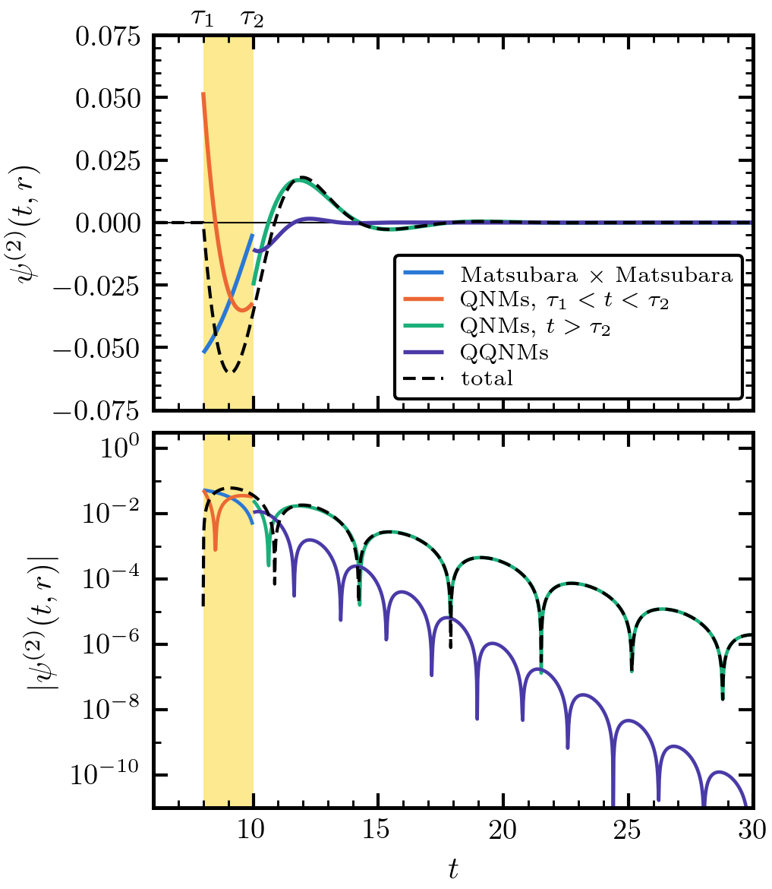
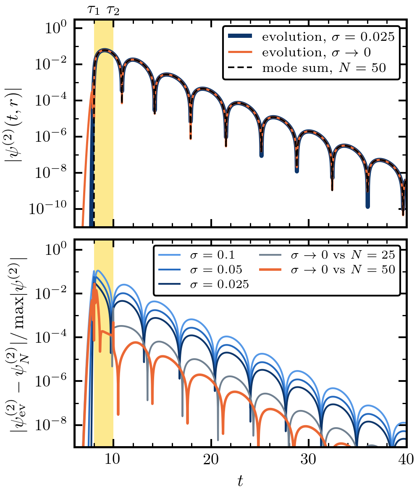
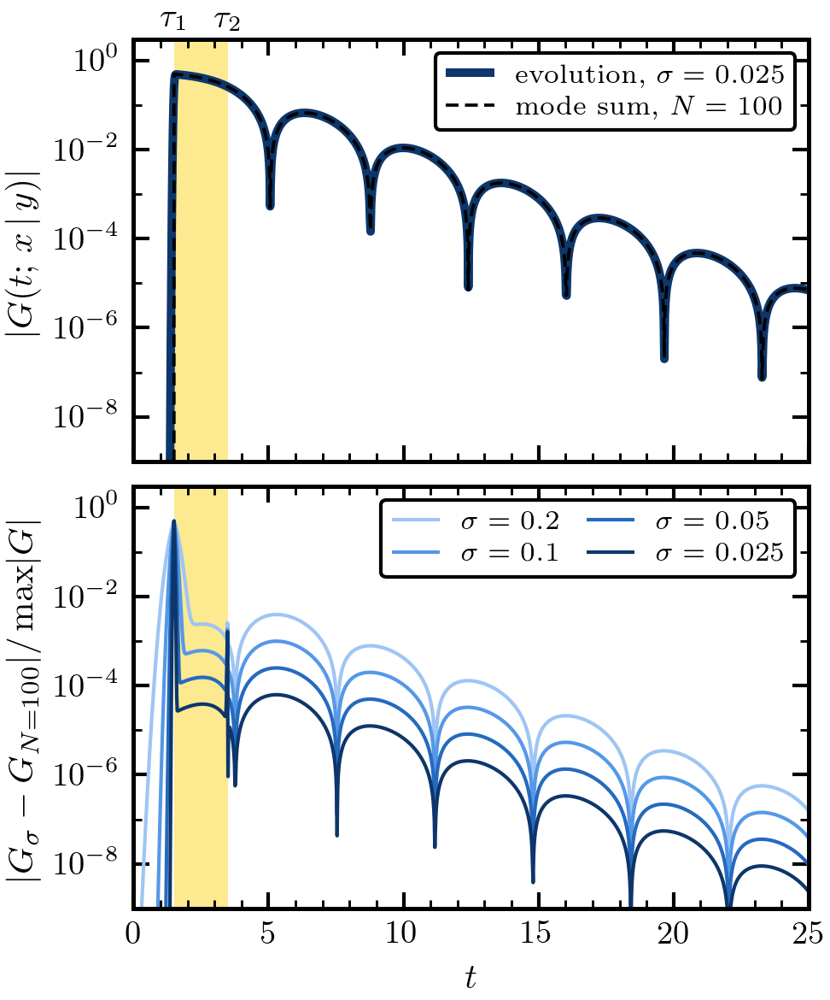

### F4 — Which modes make up the second-order field, and when? (unverified)

<figure><figcaption>The analytic $\psi^{(2)}(t, r = 4)$ split by mode family: the jumps of each family cancel in the total, and the QQNMs fade twice as fast as the linear QNMs.</figcaption></figure>

Geometry A ($r_S = -1$, $r_{NL} = -2.5$, observer $r = 4$), $\alpha = V_0 = a = 1$, analytic three-window solution truncated at $N = 50$ per family. Top: $\psi^{(2)}$, linear scale; bottom: $\lvert\psi^{(2)}\rvert$, log scale. Blue: Matsubara × Matsubara, $\sum_K c_K\, G_{\rm out}(iK)$ (window II). Coral: the outer propagator's QNMs driven by the Matsubara part of $\psi^{(1)}$ (window II). Green: the linear QNMs after $\tau_2$, with coefficients $-\mathcal{C}_{\rm out}(\omega_Q)\, s^{(2)}(\omega_Q)$. Violet: the QQNMs at $\omega_Q + \omega_{Q'}$, all ordered pairs. Black dashed: the total. Yellow: window II, $8 < t < 10$.

**Takeaway.**

- Every family jumps at $\tau_1$ or $\tau_2$; the jumps cancel, and the total is continuous and starts from zero at $\tau_1$.
- In window II the Matsubara × Matsubara part and the QNM part are the same size (peak $\approx 0.05$ each).
- After $\tau_2$ the QQNMs decay like $e^{-(n+m+1)t}$, against $e^{-(n+1/2)t}$ for the linear QNMs. Their peak relative to the total is 30% at $t = 12$, 6% at $14$, 0.2% at $20$. The late second-order signal is the linear QNMs, with amplitudes set by $s^{(2)}(\omega_Q)$.

**Reproduce.** `tasks/t02-time-domain/S5/money_plots.py` after `S5/terms.py 50 4` (terms and the family split).

### F3 — Does the evolved second-order field converge to the analytic solution? (unverified)

<figure><figcaption>Yes: after extrapolating the Gaussian width to zero, the evolution matches the $N = 50$ mode sum to $6\times10^{-5}$ of the peak after $\tau_2$.</figcaption></figure>

Geometry A, both deltas replaced by unit Gaussians of width $\sigma$; 4th-order finite differences + RK4, $\Delta r = \sigma/16$. Top: $\lvert\psi^{(2)}(t, 4)\rvert$; navy, evolution at $\sigma = 0.025$; coral, the extrapolation $u_0 = (8u_{0.025} - 6u_{0.05} + u_{0.1})/3$; black dashed, the analytic sum at $N = 50$. Bottom: residual over the peak; blue, each $\sigma$; grey, $u_0$ against $N = 25$; coral, $u_0$ against $N = 50$. Yellow: window II.

**Takeaway.**

- The second-order regulator error is $O(\sigma)$, not $O(\sigma^2)$. The square of a smoothed step is not the smoothed square, so the source carries an extra impulse $\propto\sigma$ at the front of $\psi^{(1)}(t, r_{NL})$. Its late-time imprint is $c\,\sigma\,G(t - 1.5, 4 \vert r_{NL})$ to 0.3%, with $c \to -0.167$.
- Outside $\lvert t - \tau_i\rvert < 0.5$ the extrapolated evolution agrees with the analytic solution at $N = 50$ to $7.2\times10^{-4}$ (window II), $5.9\times10^{-5}$ (window III), $1.4\times10^{-5}$ ($t \ge 15$) of the peak.
- From $N = 25$ to $50$ the window-III residual drops 5.7×. At $N = 25$ the truncation of the mode sum set the error. In window II the two truncations agree to $10^{-8}$, so the $7\times10^{-4}$ left there comes from the evolution.
- Controls: dropping the window-II QNM term or the QQNMs gives $0.58$ and $0.19$.
- An $N = 100$ run is under way; the figure will be updated.

**Reproduce.** `tasks/t02-time-domain/S3/second_compare.py` (evolutions), `S5/terms.py 50 4`, `S5/metrics.py`, `S5/money_plots.py`.

### F2 — Does the evolved linear Green's function match the mode sum at all times? (unverified)

<figure><figcaption>Yes: away from the light-cone edges the residual falls like $\sigma^2$, to $6\times10^{-5}$ of the peak at $\sigma = 0.025$.</figcaption></figure>

Case 2: source $y = -2.5$, observer $x = -1$. Top: $\lvert G(t; x\vert y)\rvert$; navy, evolution at $\sigma = 0.025$; black dashed, the windowed mode sum at $N = 100$. Bottom: $\lvert G_\sigma - G_{N=100}\rvert$ over the peak, $\sigma = 0.2, 0.1, 0.05, 0.025$ (light to dark). Yellow: the window $1.5 < t < 3.5$ (zero-mode plateau plus Matsubara sums); after it, QNMs only.

**Takeaway.**

- Off the edges the residual is the Gaussian's second moment: $\propto\sigma^2$. Averaging the mode sum over the same Gaussian removes it (to $2.6\times10^{-7}$).
- At $t = \tau_{1,2}$ the Green's function jumps; the evolution smooths the jump over a width $\sim\sigma$.
- Adding modes at fixed $\sigma = 0.025$ lowers the residual from $0.3$ ($N = 1$) to the $\sigma^2$ floor; this holds also inside a long Matsubara window.
- Controls: dropping the zero-mode plateau, or flipping the sign of the initial data, gives $O(1)$.

**Reproduce.** `tasks/t02-time-domain/S2/linear_compare.py`, `S2/linear_modes.py`, `S5/money_plots.py`.

### F1 — Is the analytical second-order solution correct? (unverified)

Yes, up to fixable errors. main.tex is correct apart from one factor; PT.tex has six errors, all corrected.

| statement (main.tex) | relative error (MEASURED) |
|---|---|
| homogeneous solutions, $A^\pm$, $B^\pm$, $W$, QNMs, Matsubara cancellation, residue identities | $10^{-31}$ – $10^{-25}$ |
| linear windows (Case 1, Case 2) | $\propto N^{-2}$, extrapolated $7\times10^{-6}$ and $5\times10^{-8}$; controls 0.19 – 1.19 |
| $s^{(2)}(\omega)$ (eq:s2final) against quadrature | $\propto N^{-2}$ with joint truncation, $7.4\times10^{-6}$ at $N = 64$; control 0.19 |
| three-window $\psi^{(2)}$, both orderings of $r_S$, $r_{NL}$ | $2.4$ – $3.7\times10^{-4}$ (truncation floor); controls 0.04 – 0.96 |

**main.tex: one correction.** $A^+$ needs $\Gamma(\lambda)\Gamma(\bar\lambda)$ in place of $\lvert\Gamma(\lambda)\rvert^2$; they differ when $4V_0 < \alpha^2$.

**main.tex: clarifications.**

- eq:s2final must be truncated jointly (Matsubara index $k$ with overtone $n = k$); its two sums converge only like $1/N$ separately.
- $s^{(2)}$ is regular at the QNMs (the poles cancel pairwise), so $s^{(2)}(\omega_Q)$ means the value of the whole sum.
- The $\tau_1 < t < \tau_2$ step needs $\psi_{1,U} + \psi_{2,U} = 0$ (shown in PT.tex).
- The QQNM sum runs over all ordered pairs from $\{\omega_Q, \bar\omega_Q\}$.
- $\omega_{Q,n} + \bar\omega_{Q,m} = -i\alpha(n + m + 1)$ lies on the Matsubara lattice.
- Minor: eq:C0 repeats eq:lemma2a; state $A^-B^+ - A^+B^- = 1$; the large-$\omega$ asymptotics hold at fixed $r$; write $\simeq$ in the explicit $\tilde\psi^{(2)}$ forms; typos.

**PT.tex: six errors, corrected** ([§3](#derivations)): the QNM excitation coefficient; the four Matsubara residue formulas (off by a factor $i$); the argument of $\mathcal{C}^\infty_1(0)$; the missing zero-mode plateau in the linear windows (a 119 % error without it); Appendix C's $f(A, B, y)$; the exponent of the $B$ term in the general solution.

**Takeaway.** The analytical solution stands. The time-domain comparison can rely on it, provided the mode sums are truncated jointly and $G$ at QQNM frequencies is taken as a limit.

**Limits.** One parameter point and one or two geometries per configuration; the window checks stop at a $2$–$4\times10^{-4}$ truncation floor; the mixed QQNM pairs are invisible numerically after $\tau_2$; the "Previous version" section of PT.tex was not checked.

**Reproduce.** The checks are scripts in the project's `tasks/t01-check-derivations/` (`S1/`, `S2/`, `S3/`, shared code in `code/pt.py`), with sympy 1.14 and mpmath 1.3. Draft checked at its commit `da925ee`.
